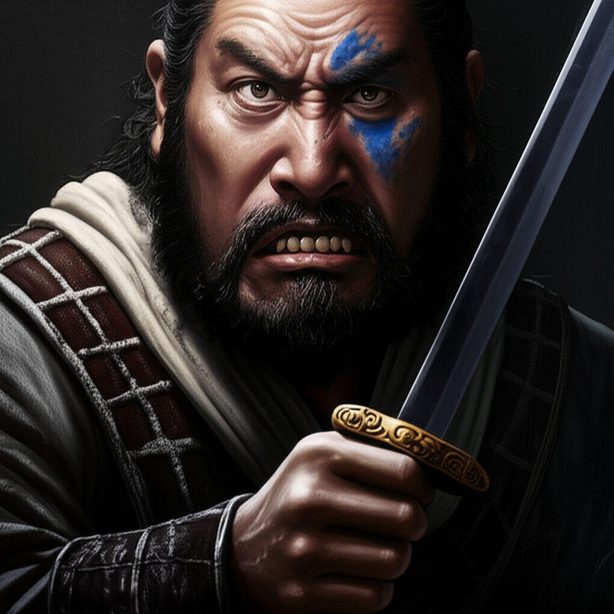

# 个人剧本：杨志 (青面兽)

## 你的身份

你是“青面兽”杨志，将门之后，武艺高强。你曾因失陷花石纲而被贬，好不容易得到梁中书的赏识，将护送生辰纲这件天大的功劳交给你，指望你能借此重返官场。

## 你的秘密

你对死者周全都管恨之入骨。

这个周全，名为协助，实为梁中书派来监视你的眼线。一路上，他对你指手画脚，颐指气使，还处处克扣军汉们的用度，早已引得天怒人怨。

在黄泥冈，正是他不断催促大家赶路，并带头喝下了那桶有问题的酒，才导致了最终的悲剧。

在你醒来后，发现生辰纲被劫，周全已死，你心中除了绝望，竟也有一丝快意。但你立刻意识到，你成了最大的嫌疑人。所有人都知道你和周全不和，现在他死了，生辰纲丢了，官府最合理的推断就是你“监守自盗，杀人灭口”。

你跳进黄河也洗不清了。你现在唯一的希望，就是找出真正的凶手，证明自己的清白。

## 你的时间线

*   **14:00:** 你和其他人一样，喝下蒙汗药酒后昏倒。
*   **15:30:** 你醒来，发现生辰纲被劫，周全都管死亡。
*   **17:00:** 你带领手下进入客栈避雨，遇到了晁盖等人。
*   **19:00:** 你请来了仵作何九叔。

## 你的任务目标

1.  **首要目标：洗脱自己的嫌疑。** 你必须证明自己没有杀人，更没有监守自盗。
2.  **次要目标：找出劫走生辰纲的劫匪和杀死周全的真凶。** 你怀疑这两者是同一伙人，他们不仅劫财，还杀人嫁祸于你。
3.  **最终目标：追回生辰纲。** 这是你唯一的救赎，如果能找回生辰纲，你或许还有一线生机。

## 你知道的线索

*   你知道你和周全的矛盾是公开的，这是对你最不利的一点。
*   你检查过周全的尸体，发现他身上除了后颈似乎有一个极小的红点外，再无其他伤痕。
*   你怀疑那个卖酒的白胜有重大嫌疑，但他看起来不像是个会用如此精妙手法杀人的人。

---
## 结局

**如果你成功找出真凶：**
> 真相大白，你洗脱了不白之冤。虽然生辰纲未能追回，但你保住了性命和清白。你对这个黑暗的官场彻底失望，最终选择离开，前往二龙山落草，凭自己的本事闯出一片天。

**如果你被冤枉：**
> 你百口莫辩，所有的证据都指向你。你被官府认定为凶手，押解回大名府。最终，你被当作梁中书失职的替罪羊，在闹市被处斩，悲惨地结束了你英雄的一生。
