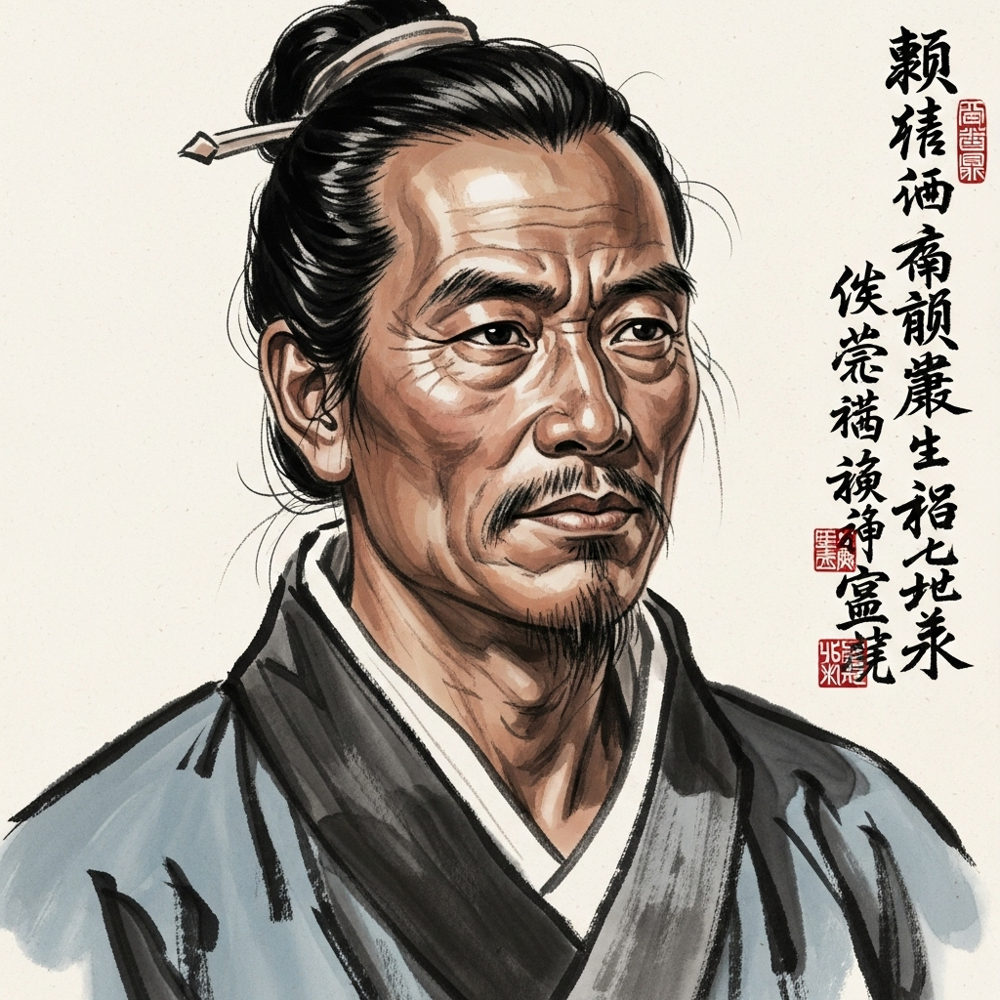

# 个人剧本：晁盖 (托塔天王)

## 你的身份

你是郓城县东溪村的保正，人称“托塔天王”的晁盖。你仗义疏财，义薄云天，在江湖上颇有威名。

## 你的秘密

**你就是劫取生辰纲的团队首领。**

你听闻梁中书搜刮民脂民膏，凑了十万贯生辰纲要送给奸臣蔡京，心中大怒。你认为这是不义之财，当取之，用之于民。

于是，你联合了智多星吴用、赤发鬼刘唐、白日鼠白胜等人，定下了“智取生辰纲”的计策。

你们的计划很明确：用蒙汗药迷倒杨志等人，只劫财，不害命。这也是你作为江湖好汉的底线。

计划进行得很顺利，你们成功劫走了生辰纲。但让你万万没想到的是，团队的军师吴用，竟然背着你，多此一举地杀了一个都管。

在客栈里，吴用悄悄告诉你，他杀人是为了防止身份暴露，并能嫁祸杨志，为你们的撤离争取时间。你虽然觉得他的做法太过阴狠，违背了你的原则，但事已至此，你们是一个团队，你必须保护他。

## 你的时间线

*   **14:00:** 你和众人一起，劫走了生辰纲。
*   **14:30:** 吴用曾短暂离队，你当时并未在意。
*   **17:00:** 你们假装路人，进入客栈避雨。
*   **案发后：** 吴用向你坦白了杀人的事实。

## 你的任务目标

1.  **首要目标：保护你的团队，特别是吴用。** 你必须想尽办法，洗脱整个团队的嫌疑，尤其是不能让别人发现吴用是凶手。
2.  **次要目标：将嫌疑引向杨志或其他人。** 吴用的“嫁祸”之计虽然阴险，但确实是目前最好的策略。你要引导大家相信，是杨志监守自盗，或者护送队内讧。
3.  **最终目标：带领兄弟们安全撤离，将生辰纲妥善处理。**

## 你知道的线索

*   你知道吴用是真凶，也知道他的作案动机。
*   你知道整个“智取生辰纲”的计划，但你要假装毫不知情。
*   你可以利用你“保正”的身份，假装公正地分析案情，从而误导他人。
*   你知道刘唐性格火爆，可以利用他来吸引注意力，作为烟雾弹。

---
## 结局

**如果你成功保护了团队：**
> 你凭借你的威望和吴用的智谋，成功地将这起命案嫁祸给了官府，并带领兄弟们安全撤离。你们将生辰纲分发给了贫苦百姓，从此名震江湖，最终集体上了梁山，开创了���番大事业。

**如果吴用的罪行被揭露：**
> 军师吴用被指认为凶手，你的团队因此分崩离析。你虽然想救他，但无力回天。你带着剩下的兄弟仓皇逃窜，虽然保住了性命，但元气大伤，你的“替天行道”之路，也因此蒙上了阴影。
