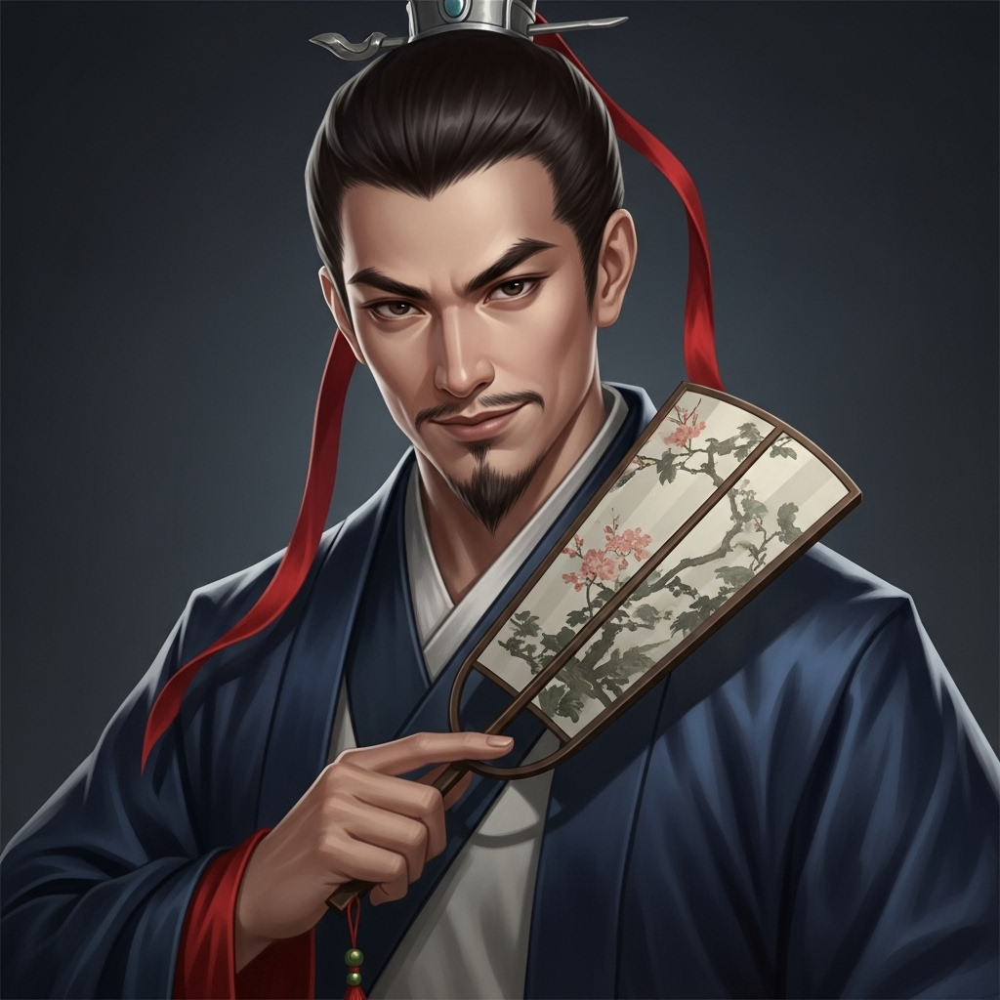

# 个人剧本：吴用 (智多星)

## 你的身份

你是一名乡村秀才，足智多谋，人称“智多星”，吴用。你是晁盖的挚友和团队的军师。

## 你的秘密

**你就是杀死都管周全的真凶。**

“智取生辰纲”的整个计策，都出自你手。你算准了天气、人心和每一个细节。

然而，在你们成功劫走生辰纲，准备撤离时，你为了确保万无一失，悄悄返回了现场。你发现，那个叫周全的都管，竟然比其他人先一步恢复了意识！他看到了你的脸，并认出你就是附近有名的吴秀才。

那一刻，你心中杀机已现。你知道，一旦他活着报官，你们整个团队都会在几个时辰内被一网打尽。

为了保护兄弟们，也为了这个“替天行道”的完美计划，你没有丝毫犹豫。你走上前，趁他不备，从你随身携带的折扇扇骨中，抽出一根淬了微毒的钢针，迅速刺入了他耳后的翳风穴。他哼都没哼一声，就当场毙命。

你做完这一切，处理好痕迹，才追上晁盖等人。你向晁盖坦白了此事，并说服他，这是唯一的办法。

## 你的时间线

*   **14:00:** 参与劫取生辰纲。
*   **14:30:** 你独自返回案发现场。
*   **14:45:** 你用钢针杀死了提前醒来的周全都管。
*   **15:00:** 你离开现场，追上大部队。
*   **17:00:** 你和晁盖等人一起，以路人的身份进入客栈。

## 你的任务目标

1.  **首要目标：你是凶手。你的唯一任务就是隐藏自己，不被任何人发现。** 你要利用你文弱书生的外表，让所有人都无法将你和杀人凶手联系起来。
2.  **次要目标：完美地嫁祸给杨志。** 这是你杀人计划的一部分。你要引导大家相信，现场的死亡，是杨志为了掩盖自己盗窃生辰纲而为之。
3.  **最终目标：保护团队和生辰纲的安全。**

## 你知道的线索

*   你知道完整的作案手法和动机。
*   你的折扇是凶器，这是对你最致命的威胁。你必须确保没有人能发现它的秘密。如果有人要检查，你要表现得非常大方，因为你知道，不拆开扇骨，谁也看不出破绽。
*   你知道死者的致命伤非常专业，你可以利用这一点，将嫌疑引向“懂行”的人，比如官府内部的人，暗示是内部仇杀。
*   你是最后一个到达客栈的，你需要一个合理的解释（比如“我为了避雨，在���处多待了一会儿”）。

---
## 结局

**如果你成功逃脱：**
> 你的计谋天衣无缝。你不仅成功劫取了生辰纲，还用一桩命案完美地搅乱了官府的视线，带领兄弟们全身而退。你的智慧和果决，让你成为了团队中无可替代的灵魂人物。梁山之上，你的每一次计谋，都将决定好汉们的命运。

**如果你的罪行被揭露：**
> 你的秘密最终还是被揭开了。当众人得知这个看似手无缚鸡之力的书生，才是最心狠手辣的凶手时，都感到了不寒而栗。你的兄弟们虽然想保你，但在铁证面前也无能为力。你最终被官府缉拿，你的“智多星”传说，就此终结。
