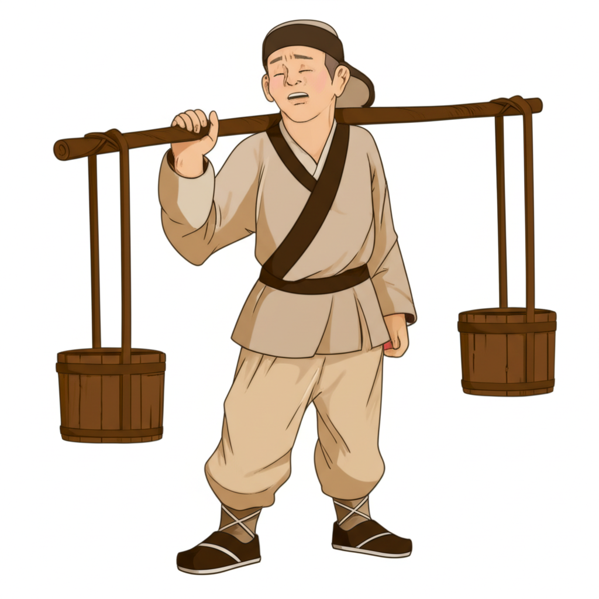

# 个人剧本：白胜 (白日鼠)

## 你的身份

你是一个混迹于乡里的闲汉，绰号“白日鼠”，白胜。你生性机灵，但有些贪财。你是晁盖的远房亲戚，这次被他找来，参与“智取生辰纲”的计划。

## 你的秘密

你在执行计划时，偷偷藏了一小坛蒙汗药酒。

在黄泥冈，你的任务是扮演卖酒郎，将下了药的酒卖给杨志一行人。在完成任务后，你觉得这蒙汗药是个好东西，以后或许能派上用场。于是，你趁着众人不注意，偷偷将一小坛没用完的药酒，藏在了自己挑的空酒桶的夹层里。

你并不知道后来发生了命案。当你听说死了人时，你吓坏了。你害怕官府搜查时，会发现你私藏的这坛药酒。一旦被发现，你就算不是凶手，也脱不了干系。

你现在唯一的念头，就是找机会把这坛酒处理掉，不能让任何人发现。

## 你的时间线

*   **13:00:** 你扮演卖酒郎，成功让杨志等人喝下了蒙汗药酒。
*   **13:10:** 你偷偷藏起了一小坛药酒。
*   **14:00:** 你和晁盖等人一起，将生辰纲运走。
*   **17:00:** 你挑着空酒桶，和大家一起进入客栈避雨。

## 你的任务目标

1.  **首要目标：隐藏你私藏蒙汗药酒的事实。** 这是你的死穴，你必须想办法在不被人发现的情况下，处理掉这个物证。
2.  **次要目标：洗脱自己的嫌疑。** 你是计划的关键执行人，很多人都看到你和杨志他们接触过。你需要表现得像一个被卷入事件的无辜村民。
3.  **最终目标：拿到你应得的那份财宝。** 你冒了这么大的风险，就是为了钱。你需要确保晁盖能兑现承诺。

## 你知道的线索

*   你知道蒙汗药只会让人昏睡，不会致命。所以，周全都管的死，肯定另有原因。
*   你手中的药酒，既是危险品，也是关键证据。它可以证明死者的死因与蒙汗药无关。如何利用它，是你的挑战。
*   你看到了吴用在大家离开后，又一个人鬼鬼祟祟地在黄泥冈上待了一会儿。你当时没多想，现在觉得他很可疑。

---
## 结局

**如果你成功隐藏了秘密并分得财宝：**
> 你有惊无险地度过了这次危机。你找机会处理掉了私藏的药酒，并最终从晁盖那里，拿到了一大笔钱财。你用这笔钱置办了家业，娶了妻子，从此过上了富足的生活。

**如果你私藏药酒的行为被揭露：**
> 你被搜出了私藏的药酒，这让你成了重点怀疑对象。尽管你百般解释，但在众人眼中，你就是一个贪生怕死、私藏罪证的小人。晁盖也因此对你心生芥蒂，在分财宝时，只给了你很少的一部分，并将你赶出了团队。
