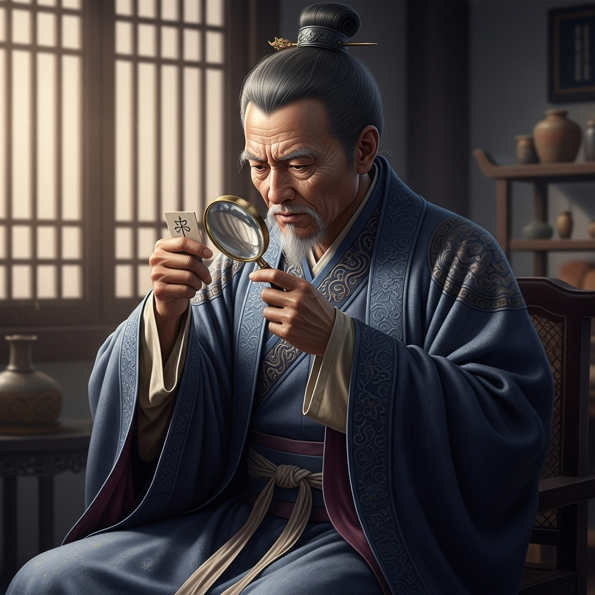

# 个人剧本：何九叔 (当地仵作)

## 你的身份

你是黄泥冈附近镇上的仵作（法医），何九叔。你为人谨慎，经验丰富，与官府关系良好。

## 你的秘密

你并不是第一次处理与这伙“好汉”相关的案子了。

数月前，在邻县，也发生过一起类似的富商被劫案，当时也留下了一具尸体。你被请去验尸，发现死者的死法与今天如出一辙，也是被某种极细的利器，刺入要害，瞬间毙命。

那次案件，最终因为找不到凶器，成了一桩悬案。但你凭借多年的经验，私下里做了一个推断：凶手是一个智商极高，且善于使用精巧机关暗器的人。绝非普通的江湖莽夫。

今天，当你看到周全都管的尸体时，你立刻就认出了这种熟悉的手法。你心中几乎可以断定，凶手与上次是同一个人，或者至少是同一个团伙。

你深知这个团伙心狠手辣，行事周密。你不想惹祸上身，因此，你决定不将上次的案件说出来，以免打草惊蛇，遭到报复。你只会就事论事，分析本次案件的疑点��

## 你的时间线

*   **19:00:** 你被官府请来，到客栈进行验尸。
*   **之后：** 你在客栈里，对尸体和现场进行了详细的检查。

## 你的任务目标

1.  **首要目标：隐藏你知道“连环杀人案”的秘密。** 你要保护好自己，不能让凶手知道你已经看穿了他的手法。
2.  **次要目标：提供专业、但有保留的验尸报告。** 你会说出你的发现（比如伤口的专业性），但你会把这些发现，引导向一个更“安全”的结论，比如“凶手可能是个懂医术的郎中，或者是个使用暗器的武林高手”。
3.  **最终目标：查明真相，但要明哲保身。** 你希望找到真凶，但你不会做出头鸟。你会把关键的发现，悄悄地透露给你认为最能主持公道的人（比如杨志）。

## 你知道的线索

*   你知道凶手是个“专业人士”，并且可能是“惯犯”。
*   你可以通过对伤口的分析，排除那些使用常规兵器的人（比如刘唐和杨志）的嫌疑。
*   你注意到，在场的吴用，虽然一副文弱书生的模样，但他的眼神异常冷静，手指关节也比寻常书生要粗大有力。你对他产生了怀疑。

---
## 结局

**如果你成功地引导了案件的侦破：**
> 你凭借你的专业和智慧，在保全自己的前提下，巧妙地引导众人找到了真凶。你的名声因此在当地变得更加响亮，官府也因此对你更加器重。

**如果你因为害怕而隐瞒了关键线索：**
> 你因为害怕报复，不敢说出你最关键的推断。最终，案件走向了一个错误的方向，真凶得以逃脱。你虽然保住了自己，但心中却留下了一个永远的疙瘩，时常在午夜因此而惊醒。
