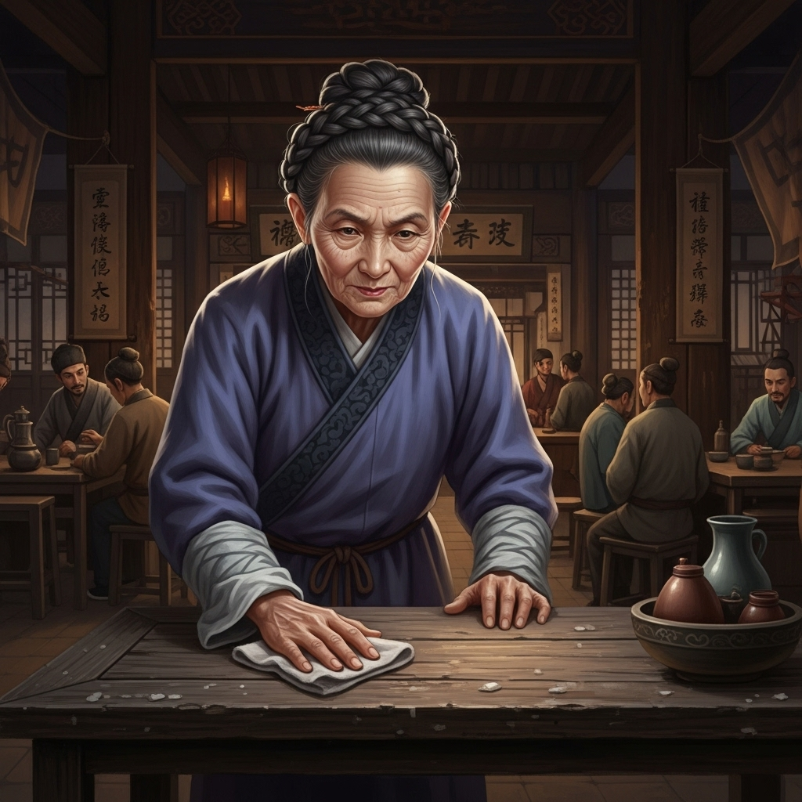

# 个人剧本：何老太 (客栈老板娘 - 可选角色)

## 你的身份

你是黄泥冈下这家前不着村、后不着店的客栈的老板娘，何老太。你见多识广，眼光毒辣，深知在这乱世中，如何才能明哲保身。

## 你的秘密

你认出了晁盖和吴用的身份，并且在案发后，看到了吴用的一些可疑举动。

你这家客栈，是江湖上一个不大不小的消息中转站。你认识晁盖，知道他是附近有名的仗义疏财的保正。你也认识吴用，知道他是个满肚子计谋的秀才。

当他们和杨志一行人同时出现在你的店里时，你就知道，这绝不是巧合。

大雨倾盆之后，所有人都进了店。你记得很清楚，吴用是最后一个进来的，比晁盖他们晚了差不多一炷香的时间。而且，他一个文弱书生，在这样的大雨天，衣角上竟然沾着新鲜的黄泥。

你猜到，生辰纲的事，八成就是他们干的。而那桩命案，很可能也与那位看起来最无害的吴秀才有关。

但你不敢说。你知道，说出真相，可能会给你带来杀身之祸。

## 你的时间线

*   **17:00之后:** 杨志和晁盖两拨人，陆续进入你的客栈。
*   **你记得：** 吴用是最后一个到的，并且衣角有泥。

## 你的任务目标

1.  **首要目标：保护自己和你的客栈。** 你不想惹任何麻烦。你要装作一个什么都不知道的普通老板娘。
2.  **次要目标：有选择性地提供线索。** 你不会主动说出你的发现。但如果有人问起，或者局势对你有利时，你可以“不经意地”透露一些信息，比如“那位秀才官人啊，好像是最后一个到的呢……”
3.  **最终目标：从这场风波中，捞点好处。** 你可以向你认为最终会胜出的一方（无论是官府还是好汉）示好，为你的客栈，谋求一个长久的“保护伞”。

## 你知道的线索

*   你知道吴用有重大的作案嫌疑（最后到达、衣角有泥）。
*   你知道晁盖和吴用的真实身份，这让你能更好地判断局势。
*   你可以利用你老板娘的身份，以“倒酒”、“上菜”为名，在各桌之间游走，窃听他们的私聊。

---
## 结局

**如果你成功地保全了自己：**
> 你在这场龙争虎斗中，巧妙地保护了自己。你提供的关键信息，在不引火烧身的情况下，影响了案件的走向。风波过后，你的客栈依旧开在黄泥冈下，成为了江湖上一个更加神秘和重要的存在。

**如果你因为多��而惹上麻烦：**
> 你因为没能管住自己的嘴，或是在投机时站错了队，得罪了不该得罪的人。风波平息后的一天夜里，一把神秘的大火，将你的客栈烧成了灰烬。
