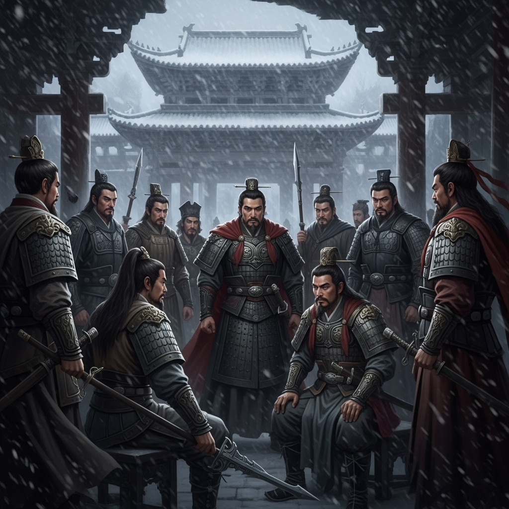

# 公共剧本：风雪山神庙

## 序幕：沧州之夜

北宋末年，朝政腐败，奸臣当道。八十万禁军教头“豹子头”林冲，因得罪了太尉高俅，被陷害刺配沧州。

沧州，北风呼啸，大雪纷飞。

今夜，是林冲看守草料场的第七天。一场罕见的大雪压垮了他栖身的草屋。为避严寒，林冲沽了一壶酒，提着一杆尖刀，踉踉跄跄地走向数里之外的古旧山神庙，想在那里暂歇一晚。

然而，他前脚刚走，身后那偌大的草料场便燃起了熊熊大火，火光映红了半边天。

## 第一幕：血染神庙

约半个时辰后，山神庙。

这座破败的古庙，今夜似乎成了各色人物的交汇点。风雪之中，数人前后脚来到了这里。

突然，一声惨叫撕裂了风雪的呼啸，紧接着是兵器碰撞和绝望的嘶吼。片刻之后，一切又重归于寂静，只剩下风雪依旧。

当最后几人推开庙门时，所有人都被眼前的景象惊得呆立当场。

庙内，血流成河。四具尸体横七竖八地倒在地上，他们是沧州牢城的管营、差��、东京来的富商陆谦，以及他的随从富安。

而“豹子頭”林冲，浑身浴血，手持尖刀，怔怔地站在尸体中间，眼中布满了血丝。他的结义兄弟“花和尚”鲁智深，提着禅杖，站在他的身侧，面色凝重。

曾受鲁智深搭救的卖唱女金翠莲，吓得躲在角落，瑟瑟发抖。林冲昔日的同僚张教头，和闻讯赶来的酒家店小二李小二，则堵在门口，一脸惊骇。

不久，得到报案的沧州府尹也带人赶到了现场。

**【初始现场线索】**

*   **死者：** 管营、差拨、陆谦、富安。四人皆已毙命。
*   **环境：** 破旧的山神庙内，桌椅翻倒，一片狼藉。地上除了尸体，还有散落的酒坛和一把沾血的尖刀。
*   **天气：** 庙外大雪纷飞，天寒地冻。草料场的大火仍在远处燃烧，忽明忽暗。

**沧州府尹（或由GM扮演）清了清嗓子，沉声喝道：“此地所有人等，皆有嫌疑！在天亮之前，务必查明真相！否则，休怪本官无情！”**

**现在，游戏开始。请各位仔细阅读自己的剧本。**
