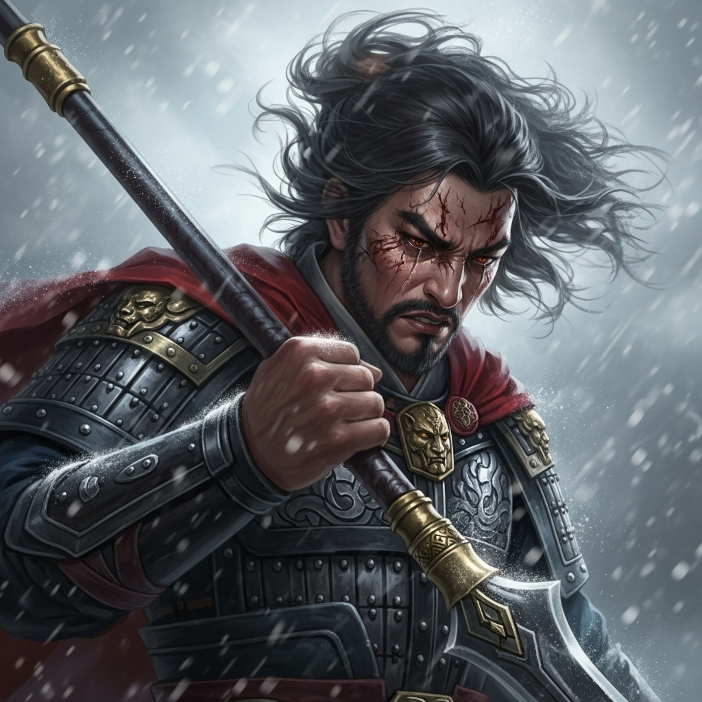

# 个人剧本：林冲 (豹子头)

## 你的身份

你是八十万禁军教头，豹子头林冲。你武艺高强，为人正直，但如今却被奸臣高俅陷害，刺配沧州。你的妻子已被逼死，家破人亡，心中充满了无尽的悲愤与仇恨。

## 你的秘密

**你就是杀死陆谦、管营和差拨的凶手。**

今晚，大雪压垮了草料场的草屋，你无奈之下只好提着防身的尖刀，去山神庙暂避。

在你离开后不久，草料场燃起大火，你心中生疑，加快了脚步。

你赶到山神庙，正想推门而入，却听到里面传来了你最痛恨的几个声音——陆谦、管营和差拨！他们正在饮酒狂欢，庆祝终于除掉了你。你躲在门外，听到了他们完整的阴谋：他们买通了禁军，烧掉草料场，就是为了将你灭口，并伪装成意外。你还听到了他们是如何一步步构陷你，逼死你妻子的全部过程。

那一刻，你被仇恨彻底吞噬。你一脚踹开庙门，用手中的尖刀，将陆谦、管营、差拨这三个仇人一一手刃。你报了血海深仇，但你也知道，自己已经没有退路了。

在你杀死三人后，陆谦的随从富安已经吓得瘫倒在地，你本想一并结果了他，但此时，你的结义兄弟鲁智深突然赶到，他拍了拍你的肩膀，让你冷静。就在这片刻的迟疑中，你没有再对富安动手。

## 你的时间线

*   **19:30:** 草屋被雪压塌，你出门买酒，随后决定去山神庙过夜。
*   **20:30:** 你抵达山神庙外，听到了陆谦等人的对话。
*   **20:45:** 你破门而入，杀死了陆谦、管营、差拨。
*   **21:30:** 你的兄弟鲁智深赶到，与你会合。
*   **22:00:** 张教头、李小二等人赶到。

## 你的任务目标

1.  **首要目标：隐藏你是凶手的事实。** 虽然你是复仇，但你不想连累你的朋友们。你希望将罪行全部揽下，或者找到一个脱身之策。
2.  **次要目标：保护鲁智深。** 你不知道草料场的大火是谁放的，但你担心这会牵连到你的好兄弟。
3.  **最终目标：活下去，上梁山！** 这是你唯一的出路。你需要说服在场的人（尤其是鲁智深和张教头），助你逃亡。

## 你知道的线索

*   你知道凶器就是你的尖刀。
*   你知道自己杀人的全部过程。
*   你不知道富安是谁杀的。在你杀死三人后，你并未立刻杀死富安，这期间发生了什么，你因为愤怒而有些模糊。你怀疑是后来进入山神庙的某个人（比如金翠莲）下的手。
*   你不知道草料场的大火是鲁智深放的，你以为是陆谦等人计划的一部分。

---
## 结局

**如果你成功逃脱：**
> 在鲁智深和朋友们的帮助下，你成功洗脱了部分嫌疑，或者说服了众人让你逃走。你与鲁智深一起，迎着风雪，奔向梁山。你的故事，将成为江湖上传颂的传奇。

**如果你被指认为所有凶案的凶手：**
> 你虽然报了血仇，但无法逃脱法网。你被沧州府尹当场拿下，最终被判处死刑。你的英雄悲歌，就此终结。
