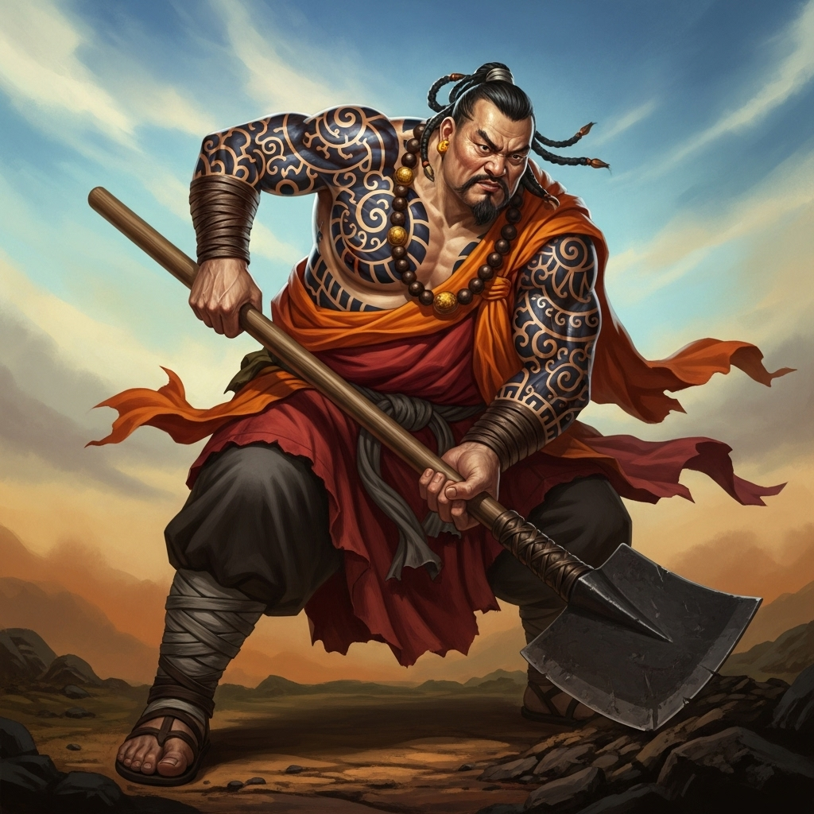

# 个人剧本：鲁智深 (花和尚)

## 你的身份

你是“花和尚”鲁智深，一个力大无穷、性格火爆但义薄云天的和尚。你与林冲在东京相识，结为异姓兄弟。因不忍林冲被陷害，你一路从东京暗中护送他到沧州。

## 你的秘密

**你就是放火烧掉草料场的人。**

你来到沧州后，一直在暗中打探消息。你得知高俅派了心腹陆谦前来，要与管营、差拨联手，在草料场害死林冲。

你性格急躁，决定先下手为强。今晚，你趁着风雪，悄悄来到草料场，用火把点燃了草堆。你心想，一把火烧了这里，陆谦他们的计划就泡汤了，林冲没了安身之处，自然会去山神庙。你的计划是，在山神庙与他汇合，然后一起去投奔梁山。

你放完火后，便抄近路赶往山神庙。但因为风雪太大，你绕了些路，耽误了时间。

当你赶到山神庙时，却被眼前的景象惊呆了——陆谦等人已经全部死在了庙里，而你的兄弟林冲，正浑身是血地站在那里。你立刻意识到，林冲已经替他自己报了仇。

## 你的时间线

*   **19:00:** 你来到草料场，放火烧了它。
*   **19:00 - 21:30:** 你在风雪中赶往山神庙。
*   **21:30:** 你抵达山神庙，看到林冲已经报仇。你上前安抚他，并准备带他离开。
*   **22:00:** 其他人陆续赶到。

## 你的任务目标

1.  **首要目标：隐藏你放火烧掉草料场的事实。** 虽然你是好意，但这在官府看来是重罪，可能会给你和林冲带来更大的麻烦。
2.  **次要目标：保护林冲。** 你要尽一切可能帮助林冲洗脱嫌疑，或者至少减轻他的罪责。你要强调他是被逼无奈，为民除害。
3.  **最终目标：带林冲一起上梁山。** 这是你此行最终的目的。你需要说服他，并协同他一起逃离这里。

## 你知道的线索

*   你知道草料场的火是你放的。你在路上不慎将自己常用的酒葫芦掉在了雪地里。
*   你赶到时，陆谦、管营、差拨、富安四人已经全部死亡。你没有看到是谁杀了富安。
*   你坚信林冲是英雄好汉，他的复仇是正义之举。
*   你怀疑富安的死有蹊跷，因为林冲的性格，不太会用毒针这种阴险的手段。你怀疑是在你赶到之前，庙里还有其他人。

---
## 结局

**如果你成功带林冲逃脱：**
> 你用你的义气和威望��成功镇住了场面。你和林冲一起，杀出重围，消失在风雪之中。梁山泊上，又多了两位威震八方的英雄头领。

**如果林冲被定罪：**
> 你虽然拼尽全力，但无法改变结局。你眼睁睁看着你的好兄弟被官府带走。你心灰意冷，独自一人上了梁山，但心中留下了永远的遗憾。
