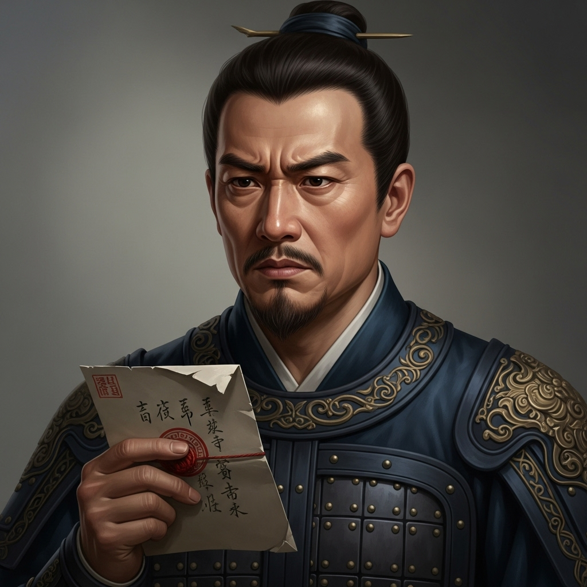

# 个人剧本：张教头 (禁军教头)

## 你的身份

你是东京八十万禁军的张教头，林冲最好的朋友和同僚。你为人正直，敬重林冲的武艺和为人。在林冲被陷害后，你心中一直愤愤不平，但迫于高俅的权势，敢怒不敢言。

## 你的秘密

你此次前来沧州，并非偶然。你是受林冲的岳父，张员外所托，前来暗中探望和接济林冲的。

张员外担心林冲在沧州受苦，便凑了一笔银两，托你务必亲手交给林冲。同时，他还给了你一封家书，信中讲述了林冲妻子因为不堪高衙内的持续骚扰，为保贞洁，已经自尽身亡的噩耗。

张员外知道这个消息对林冲是致命的打击，他让你看情况，如果林冲在沧州尚能安稳度日，就先瞒着他，免他分心；如果他已身处绝境，再将真相告知，让他断了念想，一心求生。

你来到沧州，还没来得及找到林冲，就听闻草料场起火。你心知不妙，立刻赶了过去，却在路上遇到了正要去报官的李小二。你们一同来到山神庙，看到了这血腥的一幕。

你怀中的那封致命的家书，此刻变得无比滚烫。

## 你的时间线

*   **傍晚：** 你抵达沧州，在城中打探林冲的消息。
*   **深夜：** 你听闻草料场起火，立刻赶了过去。
*   **22:00:** 你在路上遇到李小二，一同来到山神庙，成为第一批目击者。

## 你的任务目标

1.  **首要目标：保护林冲。** 你坚信你的好兄弟是被逼无奈才动手的。你要想尽办法为他开脱，证明他是正当防卫，为民除害。
2.  **次要目标：查明真相。** 你需要搞清楚整件事的来龙去脉，特别是富安的死因，这似乎与林冲的行事风格不符。
3.  **最终目标：做出你的选择。** 是否要将林夫人的死讯告诉林冲？这个消息可能会让他彻底崩溃，但也可能让他斩断尘缘，下定决心上梁山。这是一个艰难的决定。

## 你知道的线索

*   你带着一封能证明林冲有强烈复仇动机的信件。这封信既可以解释他杀人的原因，也可能成为官府给他定罪的铁证。如何使用这封信，取决于你。
*   你为人正直，在禁军中颇有威望，你的证词有很高的可信度。
*   你在路上捡到了一个烧焦的酒葫芦，你认出那是鲁智深的物品。这让你怀疑，草料场的火可能与鲁智深有关。
*   你了解林冲的为人，他光明磊落，不太可能使用毒杀这种手段。

---
## 结局

**如果你帮助林冲成功逃脱：**
> 你最终选择将真相告知林冲，让他彻底断了念想。在家国与兄弟道义之间，你选择了后者。你用你的身份和威望，为林冲和鲁智深的逃脱争取了宝贵的时间。事后，你辞去了教头的职务，归隐田园，心中却无怨无悔。

**如果林冲被定罪：**
> 你没能保护好你的朋友。你手中的家书，最终成了呈堂证供。你眼睁睁看着林冲被带走，心中充满了自责和无力。你对这个黑暗的世道彻底失望，不久便郁郁而终。
