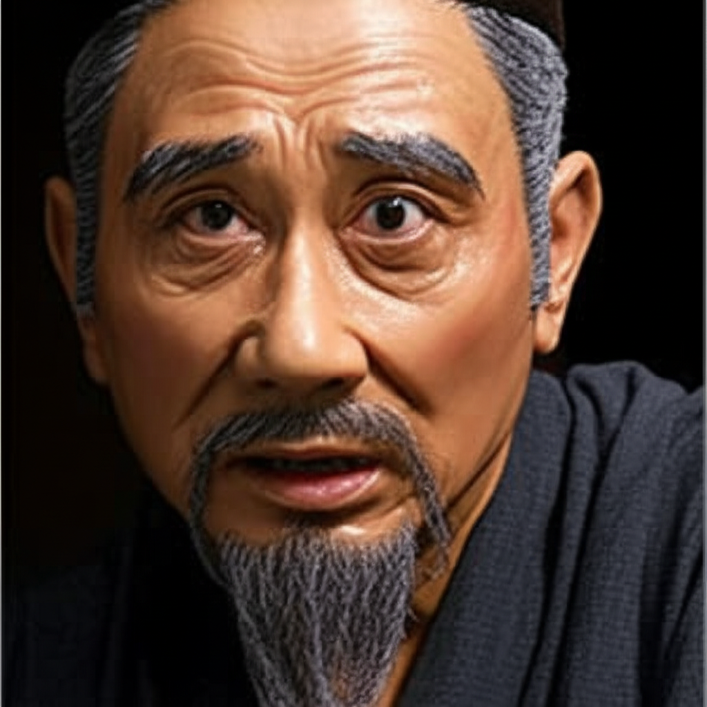

# 个人剧本：李小二 (店小二)

## 你的身份

你是在沧州城里开酒馆的店小二，李小二。一年前，你和妻子在东京逃难时，曾受过林冲教头的接济和恩惠，你一直对此感恩戴德。后来你们在沧州安顿下来，开了一家小酒馆。

## 你的秘密

你无意中成为了陆谦阴谋的窃听者。

今天傍晚，陆谦、富安、管营和差拨一行四人，就在你的酒馆里密谋。因为你的酒馆位置偏僻，他们说话声音又大，你在后厨听得一清二楚。

他们计划今晚在草料场放火，烧死林冲，并伪装成意外。你当时吓得魂不附体，一心想去给你的恩人林教头报信。

但天公不作美，风雪实在太大了，你数次尝试出门，都被风雪挡了回来。你心急如焚，坐立不安。

直到深夜，风雪稍小了一些，你再也按捺不住，立刻冲出家门，想去报官，希望能救恩人一命。你刚跑到半路，就遇到了正赶往火场的张教头。

## 你的时间线

*   **傍晚：** 你在自己的酒馆里，听到了陆谦等人的完整阴谋。
*   **傍晚 - 深夜：** 你因为风雪太大，一直无法出门报信。
*   **22:00:** 你终于冲出家门��在半路上遇到了张教头，并一同赶往山神庙。

## 你的任务目标

1.  **首要目标：报恩，保护林教头。** 你要把你知道的阴谋公之于众，证明林教头是被害者，他的行为是正当的复仇。
2.  **次要目标：提供关键证词。** 你是唯一一个能证明陆谦等人有杀人意图的证人。你的证词至关重要。
3.  **最终目标：确保正义得到伸张。** 你是一个有良知的小人物，你希望好人能得到好报，坏人能得到应有的惩罚。

## 你知道的线索

*   你是本案最关键的人证。你知道陆谦、管营、差拨有谋害林冲的完整计划。
*   你的证词可以直接为林冲的行为提供动机，证明他是自卫复仇。
*   你为人老实，你的话很容易被采信。
*   你赶到现场时，所有人都已经死了，你并不知道具体的凶案过程。

---
## 结局

**如果你的证词帮助了林冲：**
> 你的勇敢和正直，成为了案件的关键。你的证词让所有人明白了事情的真相，为林冲的复仇增添了正义性，也为他最终的逃脱创造了条件。事后，你继续经营着你的小酒馆，成为了一个在乱世中坚守良知的小人物。

**如果你的证词被忽视或被曲解：**
> 在权势面前，你一个小人物的证词显得那��微不足道。你虽然说出了真相，但无法改变官官相护的黑暗现实。林冲被定罪后，你因为害怕被报复，不得不关闭了酒馆，带着妻子远走他乡。
