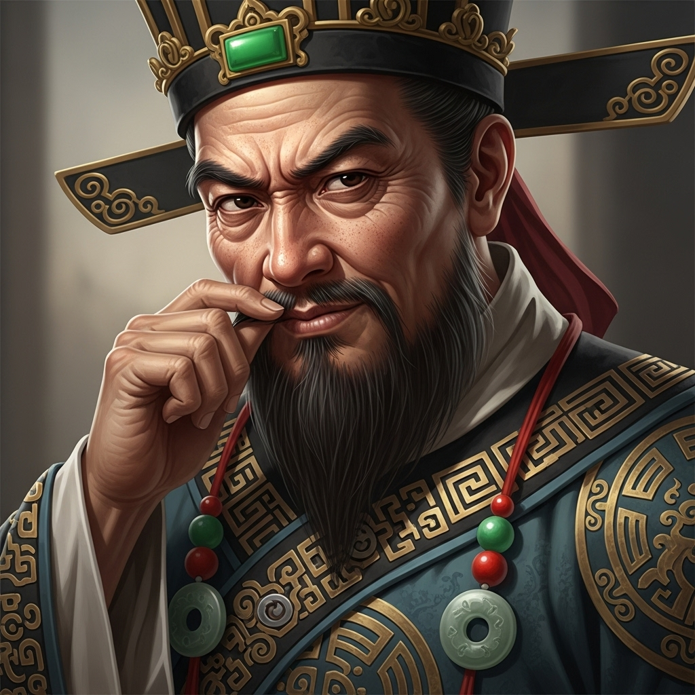

# 个人剧本：沧州府尹 (地方官 - 可选角色)

## 你的身份

你是此地的地方官，沧州府尹。你是一个典型的官僚，为官之道在于“多一事不如少一事”。你深知这起案件牵扯到京城的高太尉和八十万禁军教头，无论哪一方，都不是你这个小小的府尹能得罪得起的。

## 你的秘密

你急于了结此案。对你来说，谁是真凶并不重要，重要的是找到一个能让各方都满意（或者说，都闭嘴）的“凶手”，然后迅速结案，把这个烫手的山芋扔出去。

林冲，这个朝廷的钦犯，无疑是最好的人选。将所有罪名都推到他身上，既可以向高太尉邀功，又顺理成章，不会引起太大的波澜。

你一来到现场，就已经打定了主意。你接下来的所有调查，都将是引导性的，目的就是为了坐实林冲的罪名。

## 你的时间线

*   **深夜：** 你在睡梦中被下人叫醒，得知草料场起火，并且山神庙发生命案。
*   **22:15:** 你带着一队人马，匆匆赶到山神庙。

## 你的任务目标

1.  **首要目标：尽快结案，将所有命案都归咎于林冲。** 这是最符合你利益的选择。你需要利用你���权力，引导和控制整个调查的方向。
2.  **次要目标：无视或曲解对林冲有利的证据。** 比如，李小二的证词，你可以说他是林冲的同党；张教头的辩解，你可以说他是徇私枉法。
3.  **最终目标：保住你的乌纱帽。** 在这个乱世，活下去，并且活得好，才是最重要的。

## 你知道的线索

*   你知道高太尉是绝对不能得罪的。陆谦是高太尉的人，他死在了你的地界，你必须给高太尉一个交代。
*   你知道林冲的身份，一个“钦犯”，是最好的替罪羊。
*   你拥有定义案件走向的权力。你可以决定相信谁的证词，不相信谁的证词。
*   富安的死因（中毒）与其他人不同，这对你来说是个麻烦。你需要想办法把这件事也合理地“安排”在林冲头上，比如，说他为了灭口，用了多种手段。

---
## 结局

**如果你成功将罪名推给林冲：**
> 你用你精湛的官场手腕，成功地将这起复杂的案件，简化成了一起钦犯杀人案。你迅速结案，并上报朝廷，得到了高太尉的赏识。你的官位，因此而更加稳固。你深知，在这个世道，真相并不重要。

**如果你的意图被揭穿，且真凶被找出：**
> 你的如意算盘被鲁智深、张教头等人彻底打乱。他们揭露了你的意图，让你在众人面前威信扫地。虽然你没有受到实质性的惩罚，但你的官声算是彻底毁了。不久之后，你便被调任到了一个更偏远的地方。
