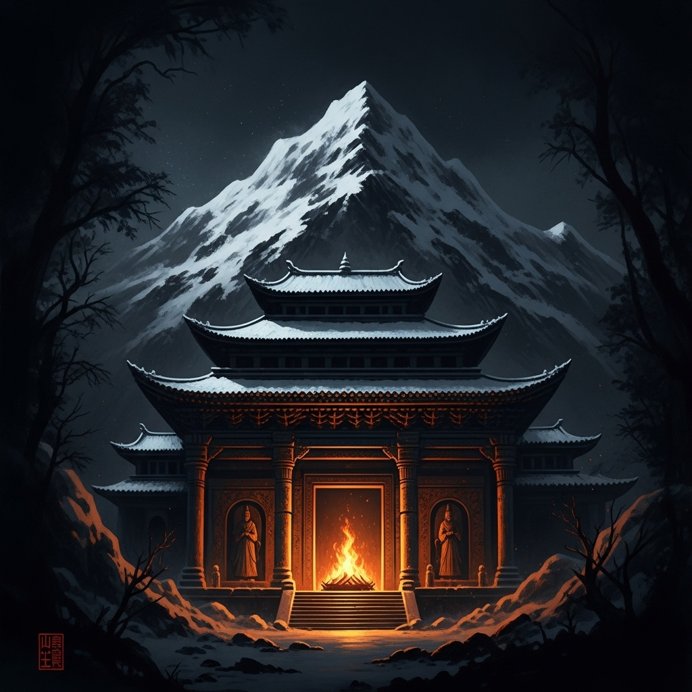

# GM手册：风雪山神庙

## 游戏概述

这是一个以《水浒传》经典桥段“风雪山神庙”为背景的7人剧本杀游戏（5核心+2可选）。玩家将扮演卷入山神庙血案的各方人物，在一个风雪交加的夜晚，揭开一场关于阴谋、复仇与背叛的真相。

*   **游戏人数：** 5-7人 (包含1名GM)
*   **游戏时间：** 约3-4小时
*   **核心机制：** 阵营对抗、秘密任务、多重凶案

## 故事真相

**1. 核心案件真相：**

*   **谁杀了陆谦？**
    *   **真凶：** 林冲。他在山神庙中听到陆谦、富安、差拨和管营的对话，确认了自己被陷害的全部真相。怒火攻心，用尖刀杀死了陆谦、差拨和管营。
*   **谁杀了富安？**
    *   **真凶：** 金翠莲。在林冲杀死陆谦等人后，金翠莲为了给被陆谦间接害死的父亲报仇，也为了永绝后患，用早已准备好的毒簪刺死了已经吓得魂不附体的富安。
*   **谁烧了草料场？**
    *   **纵火者：** 鲁智深。他一路暗中保护林冲，得知陆谦的毒计后，决定先下手为强，烧掉草料场，制造混乱，并引林冲到山神庙与自己汇合，同上梁山。他没想到林冲会因此直接撞破陆谦的阴谋。

**2. 完整时间线：**

*   **傍晚：** 李小二在自家酒馆听到了陆谦、富安和管营的密谋，得知他们要在草料场动手。他想去给林冲报信，但被大雪困住。
*   **入夜：** 鲁智深在沧州城外打探消息，同样得知了陆谦的毒计。他决定先放火烧了草料场，破坏他们的计划。
*   **一更天 (19:00):** 鲁智深来到草料场附近，用火把点燃了草料。大火迅速蔓延。
*   **一更半 (19:30):** 林冲因草屋被大雪压塌，出门买酒，从而躲过了大火。看到火光冲天，他提着尖刀，抄小路赶往山神庙避寒和观察情况。
*   **二更天 (20:00):** 陆谦、富安、差拨、管营四人来到山神庙，以为林冲已死在火中，正在庙内饮酒庆祝。
*   **二更半 (20:30):** 林冲赶到山神庙，在门外听到了四人的全部对话，得知了妻子被逼自尽、自己被一路陷害的真相。
*   **二更三刻 (20:45):** 林冲破门而入，怒杀陆谦、差拨、管营。富安吓得瘫倒在地。
*   **三更天 (21:00):** 金翠莲一路追踪陆谦也来到山神庙。她看到了林冲复仇的一幕。在林冲盛怒之时，她悄悄靠近富安，用毒簪将其刺死，完成了自己的复仇。
*   **三更半 (21:30):** 鲁智深赶到山神庙，准备接应林冲，却看到了满地尸体。
*   **四更天 (22:00):** 张教头奉命前来查看火情，在路上遇到了前来报官的李小二。两人一同来到山神庙，发现了惊人的一幕。不久，沧州府尹也带人赶到。

## 游戏流程

**第一幕：山神庙的惨案 (约45分钟)**

1.  GM向玩家分发公共剧本和各自的个人剧本。
2.  玩家阅读剧本（约15分钟），然后进行自我介绍。
3.  第一轮讨论：根据初始信息进行讨论。
4.  **线索分发 (第一轮):** GM向所有玩家公布【线索卡A】和【线索卡B】。

**第二幕：风雪中的秘密 (约90分钟)**

1.  玩家根据新线索进行讨论和一对一私聊。
2.  **线索分发 (第二轮):** GM向所有玩家公布【线索卡C】和【线索卡D】（图片线索）。
3.  玩家再次进行讨论，此时可以开始互相指证。
4.  **线索分发 (第三轮):** GM向所有玩家公布【线索卡E】和【线索卡F】。
5.  最后一轮自由讨论和指证。

**第三幕：水落石出 (约30分钟)**

1.  所有玩家轮流发言，陈述自己认定的凶手（需要指认杀死陆谦和富安的两位凶手）。
2.  玩家投票，选出最终的凶手。
3.  GM公布投票结果，并揭晓故事的完整真相。
4.  GM分发每个角色的结局剧本。

## 线索卡

**���线索卡A - 尸检报告】(由沧州府尹公布)**
> 陆谦、差拨、管营三人皆死于利刃，伤口深，一击致命。富安死状不同，脖颈处有一细小针孔，面色发黑，是中毒而死。死亡时间都在一个时辰之内。

**【线索卡B - 林冲的尖刀】(现场物证)**
> 一把沾满血迹的尖刀，就扔在林冲的脚边。刀的样式与死者身上的大部分伤口吻合。

**【线索卡C - 一支金簪】(图片线索)**
> 在富安的尸体旁，发现了一支做工精美的金凤簪，但簪头似乎被磨尖了，且末端有轻微的黑色淬毒痕迹。
> ****

**【线索卡D - 雪地上的脚印】(图片线索)**
> 山神庙外，大雪覆盖了大部分痕迹。但在庙门一侧，有两串不属于死者的脚印。一串极大，像是巨汉所留；另一串则较小，步子很轻，似乎属于一位女性。
> ****

**【线索卡E - 李小二的证词】**
> “傍晚我确实听到了陆谦他们在谋划，说‘草料场风大，一把火什么都干净了’，我当时就想去告诉林教头，但风雪太大，实在出不了门！”

**【线索卡F - 张教头的发现】**
> “我在来山神庙的路上，看到草料场的火势极大，不像是意外失火。而且，我在路边的雪地里，捡到了一个烧焦了一半的酒葫芦，看起来很像是鲁智深兄弟常用的那个。”

## 角色配置

*   **5人局：** 去掉 `富安` 和 `沧州府尹`。GM扮演NPC提供线索。
*   **6人局：** 去掉 `沧州府尹`。
*   **7人局：** 全员参与。
