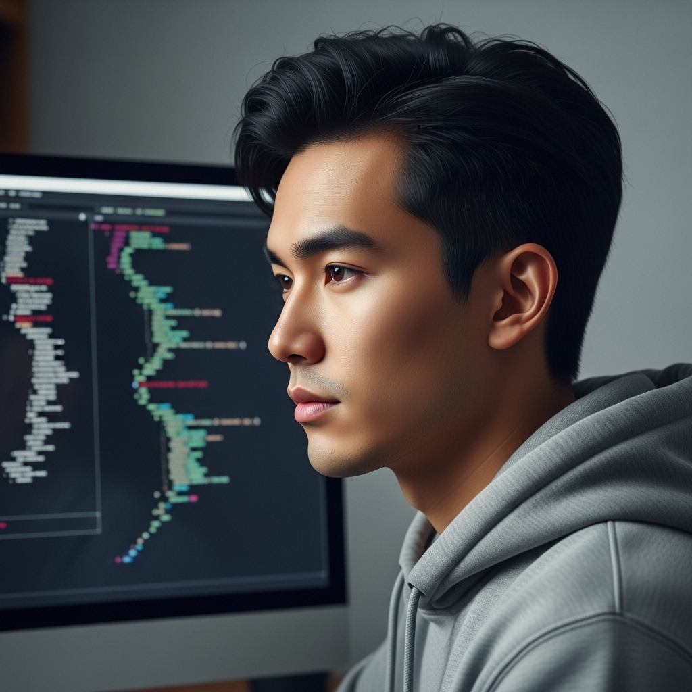

# 个人剧本：张伟 (算法大神)

## 你的身份

你是“算法大神”张伟，国内顶尖大学计算机系的博士生。你天赋异禀，在ACM等国际算法竞赛中屡获金牌，是本次“超级码霸”竞赛公认的夺冠大热门。

## 你的秘密

你对作弊事件毫不知情，但你的父亲，可能在背地里为你做了些“多余”的事。

你对自己的实力非常自信，相信凭自己的能力，拿下这个Offer只是时间问题。

但你的父亲，一位成功的商人，总觉得你的“书生气”在社会上会吃亏。他一直希望你能更“成熟”一点，懂得利用资源。在集训营开始前，他曾告诉你，他已经“打点”好了一切，让你放心去比赛。

你当时并没有在意，以为他只是在吹牛。你全身心地投入到比赛中，并凭借自己的实力，独立完成了最后一轮的算法题。你提交的代码，虽然思路与标准答案可能接近，但绝对是你自己一个字符一个字符敲出来的。

现在，作弊警报响起，你看到那份被标记为“作弊”的代码，发现它虽然逻辑上和你差不多，但实现风格和变量命名，完全不是你的风格！你立刻意识到，一定有人在你背后搞了鬼。你第一个想到的，就是你的父亲和他的“打点”。

## 你的时间线

*   **今天 10:45:** 你独立完成了题目，并提交了你的代码。
*   **之后：** 你一直在休息区和其他选手聊天，对后台发生的一切毫不知情。
*   **14:00:** 你被HR总监叫到会议室。

## 你的任务目标

1.  **首要目标：证明自己的清白。** 你必须让大家相信，你没有作弊，这份“作弊代码”不是你提交的。
2.  **次要目标：找出幕后黑手。** 你需要查清楚，到底是谁，用什么方法，替换了你的代码。你怀疑这件事和你的父亲以及面试官王磊有关。
3.  **最终目标：凭自己的实力赢得Offer。** 你要向所有人证明，你不需要任何“打点”，你就是最强的。

## 你知道的线索

*   你知道被展示的“作弊代码”不是你写的。你可以从代码风格、变量命名习惯等方面进行辩解。
*   你知道你的父亲可能在背地里做了手脚，但你没有证据。
*   你注意到，面试官王磊在整个事件中，眼神有些躲闪，并且似乎在有意无意地将矛头引向其他选手。

---
## 结局

**如果你成功找出��凶并证明清白：**
> 真相大白，你洗刷了不白之冤。公司高层对你的诚实和实力大加赞赏，虽然比赛出现丑闻，但你最终还是获得了那份梦寐以求的Special Offer。你也通过这件事，与你的父亲进行了深入的沟通，让他明白了你的原则。

**如果你被认定为作弊者：**
> 尽管你百般辩解，但在“铁证”面前，没人相信你。你被取消了比赛资格，并被加入了行业黑名单。你的职业生涯，在开始之前，就画上了一个耻辱的句号。
