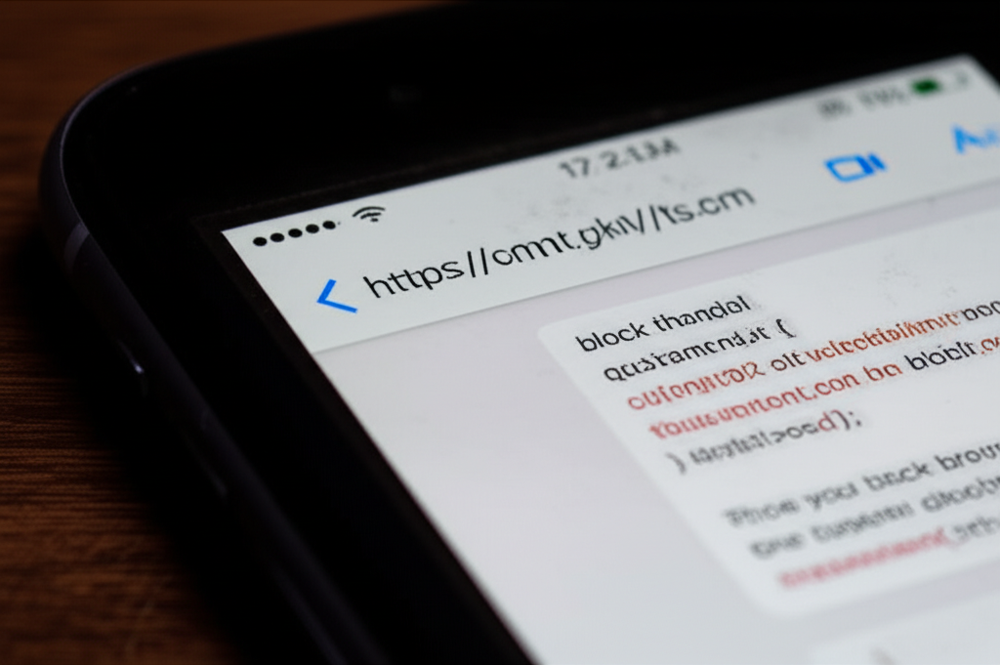
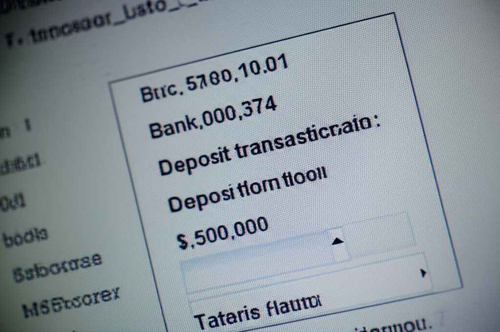

# GM手册：谁是作弊者

## 1. 游戏概述

*   **故事背景：** 在顶级科技公司“比特无限”的“超级码霸”算法竞赛集训营中，最后一轮模拟面试后，系统后台发现一份与标准答案完全雷同的作弊代码。公司高层震怒，要求在场的选手与工作人员必须找出作弊者。
*   **玩家人数：** 5-7人 (包含1名GM)。
*   **游戏时间：** 约3-4小时。
*   **核心机制：** 职场推理、秘密任务、信息博弈。

## 2. 故事真相

### 完整时间线

*   **昨天 18:00:** 最后一轮模拟面试的题目和标准答案由王磊（面试官）最终确认，并上传到加密的内部服务器。
*   **昨天 22:00:** 陈阳（前员工）利用他之前在公司时偷偷安装的、尚未被发现的系统后门，成功访问了内部服务器，并下载了包含标准答案的整个题库压缩包。
*   **今天 09:00:** 最后一轮模拟面试正式开始。
*   **今天 10:30:** 李静（转码新人）在解题过程中遇到了困难，她悄悄给自己的“场外援助”——一位在比特无限工作的朋友发消息求助。她的朋友通过公司内部通讯工具，看到了王磊与同事讨论标准答案的聊天记录片段，并将其中关键的一段代码逻辑截图发给了李静。
*   **今天 10:45:** 张伟（算法大神）凭借自己的实力，独立解出了题目，并提交了代码。他的解法与标准答案思路相似，但实现方式和变量命名完全不同。
*   **今天 11:00:** 陈阳提交了他的代码，这份代码与标准答案几乎一模一样。
*   **今天 11:10 (作弊行为发生):** 王磊（面试官）其实是作弊的真正执行者。他因为个人财务问题，收了张伟父亲的巨额贿赂，承诺要确保张伟拿到Offer。他担心张伟的解法不够“完美”，于是他利用自己的面试官权限，在后台用陈阳下载的、与标准答案完全一致的代码，覆盖了张伟之前提交的代码。他之所以选择陈阳的代码，是因为他知道陈阳有后门，这样即使被发现，也可以嫁祸给陈阳。
*   **今天 11:15:** 实习生孙悦在整理后台日志时，发现了这次异常的代码覆盖操作。
*   **今天 14:00:** HR总监赵敏收到了系统自动发出的作弊警报，召集了所有相关人员。

### 作弊者解析

*   **作弊者：** 王磊 (面试官)。
*   **作弊动机：** 贪婪。他收受了张伟父亲的贿赂，需���确保张伟获胜。
*   **作弊手法：** 利用面试官的后台权限，在最后一刻用一份“完美”的答案，覆盖了张伟自己提交的答案。他认为这样做既能完成任务，又能嫁祸给有能力获取标准答案的陈阳，一石二鸟。

### 关键线索解析

*   **提交记录 (线索A):** 系统后台显示，张伟的账号在11:10有一次代码提交记录的“更新”操作，而不是“创建”操作。这是关键的技术证据。
*   **陈阳的U盘 (线索B):** 在陈阳的私人物品中发现一个U盘，里面有题库的加密压缩包。这让他有重大嫌疑，但无法直接证明他提交了作弊代码。
*   **李静的求助信息 (线索C):** 李静的手机上有与“场外援助”的聊天记录，其中包含了一部分标准答案的代码逻辑截图。这让她陷入了“部分作弊”的嫌疑。
*   **王磊的银行流水 (线索D):** 王磊的个人银行账户，在昨天收到了一笔50万元的匿名大额转账。这是他受贿的直接证据。
*   **实习生孙悦的日志 (线索E):** 孙悦的电脑上有一份系统操作日志的本地备份，清晰地记录了在11:10，一个拥有“面试官”权限的IP地址，对张伟的提交记录执行了“UPDATE”操作。
*   **技术宅刘波的发现 (线索F):** 刘波通过分析网络流量，���现陈阳的电脑曾在昨晚有一个连接到公司内部服务器的异常数据传输。

## 3. 游戏流程

**第一幕：作弊疑云 (约45分钟)**
1.  GM分发公共剧本和个人剧本。
2.  玩家阅读剧本，进行自我介绍。
3.  第一轮讨论，围绕作弊事件本身。
4.  **线索分发 (第一轮):** 公布【线索卡A - 提交记录】和【线索卡B - 陈阳的U盘】。

**第二幕：职场的秘密 (约90分钟)**
1.  玩家根据新线索进行讨论和一对一私聊。
2.  **线索分发 (第二轮):** 公布【线索卡C - 李静的求助信息】(图片线索) 和【线索卡D - 王磊的银行流水】(图片线索)。
3.  玩家再次进行深入讨论，矛盾将指向多个角色。
4.  **线索分发 (第三轮):** 公布【线索卡E - 实习生孙悦的日志】和【线索卡F - 技术宅刘波的发现】。
5.  最后一轮自由讨论和指证。

**第三幕：水落石出 (约30分钟)**
1.  所有玩家轮流发言，陈述自己认定的作弊者和理由。
2.  玩家投票，选出最终的作弊者。
3.  GM公布投票结果，并揭晓故事的完整真相。
4.  GM分发每个角色的结局剧本。

## 4. 线索卡列表

*   **【线索卡A - 提交记录】**
    > 一份系统后台的提交时间戳记录，显示大部分选手的提交时间都在11:00��，状态为“CREATED”。只有张伟的账号，在11:10有一条记录，状态为“UPDATED”。
*   **【线索卡B - 陈阳的U盘】**
    > 在陈阳的背包里发现一个U盘。U盘里有一个名为 `final_round_questions.zip` 的加密压缩文件。
*   **【线索卡C - 李静的求助信息】(图片线索)**
    > 李静的手机聊天软件截图，显示她与一个备注为“师兄”的人的对话。师兄发来一张图片，图片内容是解题关键算法的伪代码。
    > ****
*   **【线索卡D - 王磊的银行流水】(图片线索)**
    > 一张银行账户的交易记录截图，显示户主王磊，在昨天下午收到了一笔50万元的转账，交易附言是“祝贺”。
    > ****
*   **【线索卡E - 实习生孙悦的日志】**
    > “我当时只是觉得奇怪，就备份了一下。日志显示，IP地址为10.1.1.10（王磊的面试官工位）的终端，在11:10:32，对数据库 `submissions` 表中 `user_id=zhangwei` 的条目执行了 `UPDATE` 操作。”
*   **【线索卡F - 技术宅刘波的发现】**
    > “我昨晚无聊，用Wireshark扫了一下���们集训营的内网流量。发现陈阳的电脑在22:03左右，和公司内部的IP 10.0.0.5（文件服务器）之间有一次大概20MB的加密数据传输，很不正常。”

## 5. 角色配置

*   **5人局：** 去掉 `刘波` 和 `孙悦`。GM需扮演NPC提供线索：刘波的发现由GM在第三轮以“系统安全部门的初步报告”形式公布；孙悦的日志也由GM在同一时间公布。
*   **6人局：** 去掉 `孙悦`。孙悦的日志由GM在第三轮公布。
*   **7人局：** 全员参与。
