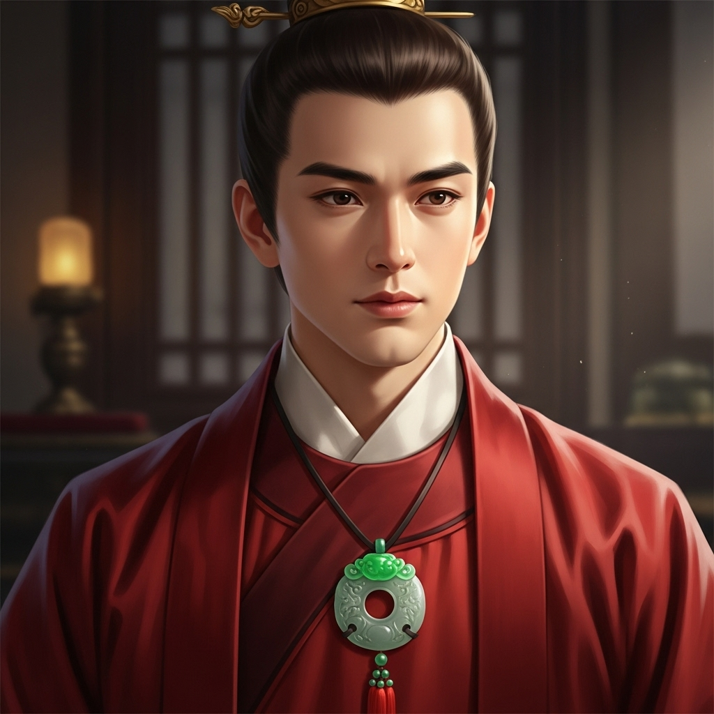

# 个人剧本：贾宝玉 (怡红公子)

## 你的身份

你是荣国府的嫡派子孙，衔玉而生的宝二爷，贾宝玉。你生性烂漫，厌恶功名利禄，只愿在女儿堆里厮混。你珍视大观园里的每一个姐妹和丫鬟，视她们为清净洁白的化身。

## 你的秘密

你虽然没有杀人，但你目击了薛蟠与贾瑞的冲突。

诗会期间，你觉得有些烦闷，便独自出来散心。你走到假山附近，正巧看到你的表兄“呆霸王”薛蟠，正揪着贾瑞的衣领大声打骂，言语中似乎是怪他偷看自己的丫鬟。

你看到薛蟠蛮横地将贾瑞推倒在地，还从他身上抢走了一块玉佩，然后才骂骂咧咧地离开。当时贾瑞虽然狼狈，但还活着，只是看起来脸色很差，嘴里嘟囔着什么“浑身燥热”。

你本想上前询问，但又觉得他们两个都不是什么正经人，不想沾惹这些是非，便转身回了诗社。你没想到，过了一个时辰，贾瑞竟然真的死了。

你现在心中很矛盾。你既不想冤枉了薛蟠，让他背上杀人的罪名；但你又担心，如果真是他干的，会连累到你的宝姐姐。

## 你的时间线

*   **18:00:** 你在海棠诗社主持诗会。
*   **18:45:** 你在假山附近，目击了薛蟠与贾瑞的冲突。
*   **18:45 - 21:00:** 你回到诗社，继续与众人说笑，但心中有些不安。
*   **21:00:** 晴雯发现尸体，你第一个赶到现场。

## 你的任务目标

1.  **首要目标：找出真凶，但要保护你关心的人。** 你不希望是薛蟠，更不希望是园子里的任何一个姐妹。你需要小心地透露你看到的信息，引导大家查明真相。
2.  **次要目标：保护晴雯。** 她是第一个发现尸体的人，你担心她会被卷入这场风波，受到不公正的对待。
3.  **最终目标：恢复大观园的平静。** 这起凶案玷污了你心中的“清净女儿国”，你希望能尽快将此事了结，让一切回归原样。

## 你知道的线索

*   你知道薛蟠和贾瑞有过激烈的肢体冲突，并且抢走了一块玉佩。
*   你知道贾瑞在死前曾抱怨自己“浑身燥热”，状态很不对劲。
*   你天性善良，你的话在姐妹们中有很高的可信度。

---
## 结局

**如果真凶被找出：**
> 真相大白，虽然过程令人心痛，但大观园终究恢复了往日的平静。你看着身边的人，有的离去，有的改变，心中不禁生出无限感慨。你写下了一首《芙蓉女儿诔》，祭奠在这场风波中逝去的纯真。

**如果你没能找出真凶，或冤枉了他人：**
> 案件以一个错误的结果了结。你心中的那片“清净女儿国”蒙上了永远的阴影。你感到前所未有的迷茫和痛苦，最终大病一场，从此变得更加痴痴傻傻。
