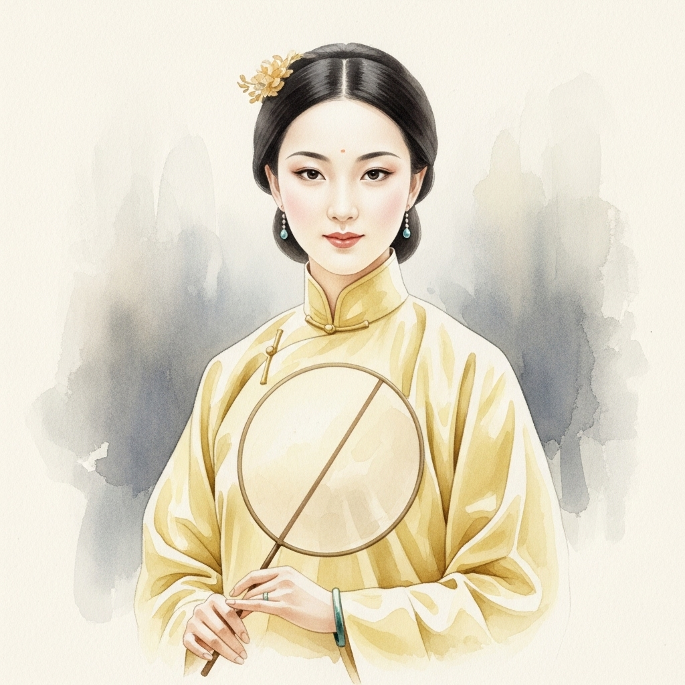

# 个人剧本：薛宝钗 (蘅芜君)

## 你的身份

你是来自四大家族之一，薛家的千金，薛宝钗。你容貌丰美，举止娴雅，为人处世八面玲珑，深得贾府上下的人心。你寄住在荣国府，是贾宝玉金玉良缘的另一半。

## 你的秘密

你怀疑凶手是你的哥哥薛蟠，并且你正在为他掩盖罪证。

你的哥哥薛蟠，绰号“呆霸王”，性情粗暴，无法无天，之前就曾为了一点小事打死过人。今晚在诗会上，他喝多了酒，中途离席，回来时脸色很难看。

在案发后，你私下悄悄问他，他承认自己和贾瑞发生了冲突，因为他觉得贾瑞的眼神很不老实。他承认自己推搡了贾瑞，还抢了他一块玉佩，但他发誓绝对没有杀人。

你心里很清楚，以你哥哥的性格，失手杀人是完全有可能的。你更担心的是，他抢来的那块玉佩会成为铁证。

为了保护哥哥和薛家的声誉，你必须想办法洗脱他的嫌疑。你决定引导大家，将注意力转移到动机更明显的王熙凤身上。

## 你的时间线

*   **18:00:** 你和宝玉等人在海棠诗社作诗。
*   **18:40:** 你的哥哥薛蟠喝多了酒，离席而去。
*   **18:50:** 薛蟠回来，你看到他神色有异。
*   **21:00:** 案发，你随众人赶到现场。
*   **案发后：** 你私下询问薛蟠，得知了冲突的经过。

## 你的任务目标

1.  **首要目标：保护你的哥哥薛蟠，洗脱他的嫌疑。** 无论他是不是凶手，你都必须保护他。这是你作为姐姐的责任。
2.  **次要目标：将嫌疑引向他人。** 王熙凤与贾瑞的恩怨人尽皆知，她是最好的怀疑对象。你需要不动声色地引导舆论。
3.  **最终目标：维持你在贾府的完美形象。** 你要在处理这件事的过程中，表现出你的聪慧、大度和善良，赢得更多人的信任和好感。

## 你知道的线索

*   你知道你的哥哥与死者有过激烈冲突，并且拿走了证物（玉佩）。这是你需要极力掩盖的。
*   你可以利用你哥哥的“呆”和“蛮”来为他辩解，说他虽然粗鲁，但不是有心计的杀人凶手。
*   你可以暗示王熙凤的动机，说“凤丫头素来是说一不二，有仇必报的性子”。

---
## 结局

**如果你成功保护了哥哥：**
> 你凭借自己的智慧和手腕，成功地将哥哥从嫌疑中摘了出来。你在这场风波中表现出的冷静和顾全大局，让贾母和王夫人都对你更加赞赏。你离“宝二奶奶”的位置，又近了一步。

**如果你的哥哥被认定为凶手：**
> 你没能保住他。薛家因为这起命案而名誉扫地，你在贾府的地位也变得岌岌可危。你虽然依旧是那个端庄得体的宝姑娘，但你的心中，第一次有了无力回天的感觉。
