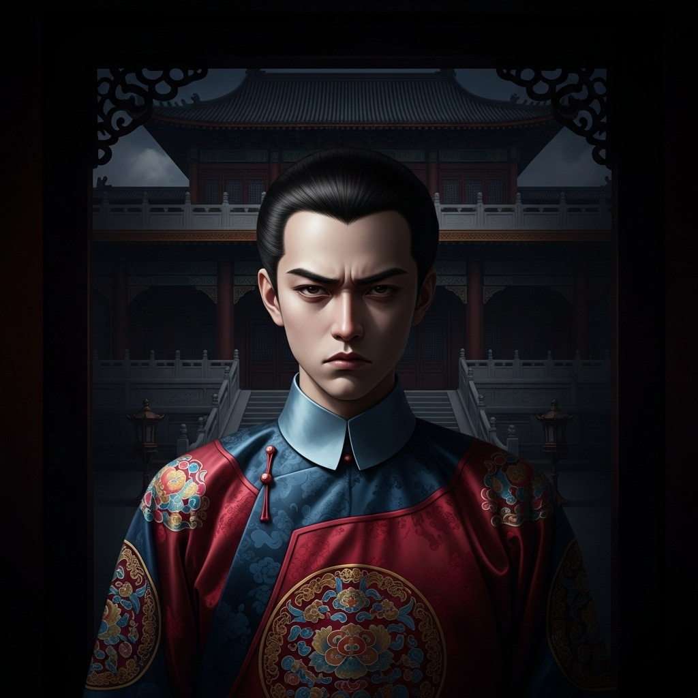

# 个人剧本：贾环 (玉字辈老三)

## 你的身份

你是荣国府的庶出少爷，贾环。你是贾政的儿子，贾宝玉的亲弟弟，但因为是赵姨娘所生，你在这个家里的地位远不如宝玉。你嫉妒宝玉，憎恨王熙凤，对这个“主子”的世界充满了怨恨。

## 你的秘密

**你就是杀死贾瑞的真凶。**

你的计划堪称一石二鸟。你痛恨王熙凤的跋扈，也看不惯贾瑞的无赖嘴脸。于是，你想出了一个借刀杀人的毒计。

你找到贾瑞，谎称有能让王熙凤“倾心”的秘药，能帮他实现好事。你将母亲赵姨娘平时用来安神的西域奇药（实则有慢性毒性）给了他一包，让他混在酒里喝下去。

你算准了贾瑞会去纠缠王熙凤，而王熙凤必定会给他难堪。这样，无论贾瑞最后是死是活，王熙凤都脱不了干系。

你躲在暗处，看着薛蟠羞辱他，看着王熙凤教训他。最后，你看到贾瑞毒性发作，倒在假山背后。你心中一阵快意，但又觉得不保险。你走上前，看到贾瑞还在微微喘气，为了确保他必死无疑，也为了发泄你心中的怨气，你搬起一块石头，重重地砸向了他的后脑。

你杀了他，但你感觉不到丝毫的恐惧，只有一种病态的兴奋。你完美地将嫌疑引向了王熙凤和薛蟠。

## 你的时间线

*   **16:00:** 你找到贾瑞，将毒药交给他。
*   **18:00 - 20:00:** 你一直躲在诗社附近，暗中观察着一切。
*   **19:30:** 你看到贾瑞倒下，上前用石头补了最后一击。
*   **21:00:** 案发后，你假装和众人一起赶到现场，并装出害怕的样子。

## 你的任务目标

1.  **首要目标：你是凶手。你的唯一任务就是隐藏自己，嫁祸他人。** 王熙凤和薛蟠是你最好的挡箭牌。
2.  **次要目标：搅乱局势。** 你要假装无辜和胆小，可以适时地说一些似是而非的话，比如“我好像看到凤姐姐的丫鬟在附近出现过”，或者“蟠大哥回来的时候脸色好难看”，来加深别人的怀疑。
3.  **最终目标：享受你的“胜利”。** 看着那些平日里高高在上的人陷入混乱和猜忌，是你最大的乐趣。

## 你知道的线索

*   你知道完整的作案经过，包括下毒和石头重击。
*   你知道王熙凤的手帕和薛蟠的玉佩都是烟雾弹，你可以尽力把火往他们身上引。
*   你知道杯中的毒渣和你母亲房里的药材有关。这是对你最大的威胁。如果有人提到，你必须立刻否认，并说自己从不碰母亲房里的东西。
*   你可能会被林黛玉指认在附近出现过，你需要准备好说辞，比如“我只是去看个热闹，什么都没看见”。

---
## 结局

**如果你成功逃脱：**
> 你的阴谋得逞了。王熙凤或薛蟠成了你的替罪羊，贾府因此陷入了巨大的混乱。没有人怀疑到你这个不起眼的庶出子弟身上。你在阴影中，露出了得意的笑容。这是你对这个不公世界的一次小小“复仇”。

**如果你的罪行被揭露：**
> 你的伪装最终被撕开。当众人得知这个看似懦弱的少年，竟有如此歹毒的心肠时，都感到了不寒而栗。你的父亲贾政对你彻底失望，将你关进家庙。你在无尽的黑暗和悔恨中，度过了余生。
