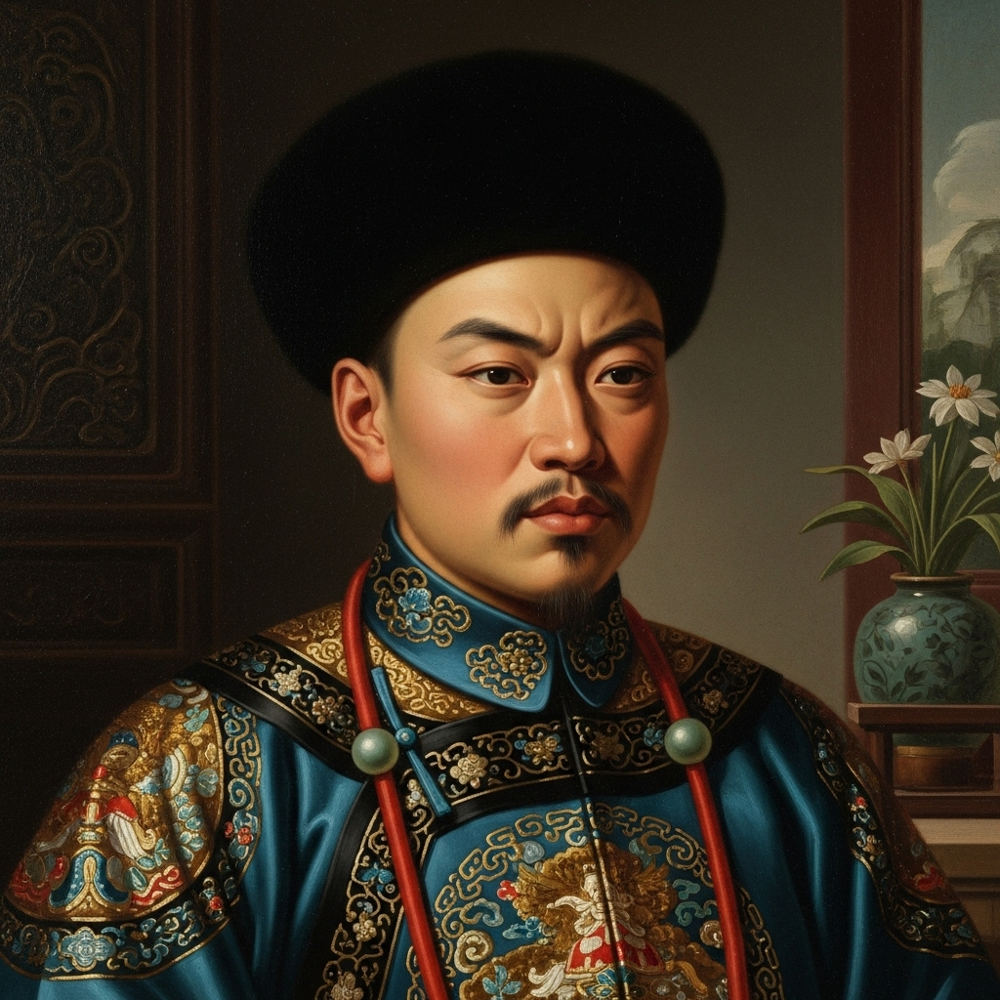

# 个人剧本：薛蟠 (呆霸王 - 可选角色)

## 你的身份

你是薛家的大少爷，薛宝钗的哥哥，薛蟠。你家财万贯，但你不学无术，性情粗暴，是金陵城里有名的“呆霸王”。你最爱喝酒闹事，行事不过大脑。

## 你的秘密

你确实在案发前，狠狠地教训了贾瑞一顿。

今晚诗会，你喝多了几杯，出来透气。你看到贾瑞那个猥琐的家伙，正贼眉鼠眼地偷看你从家里带来的小丫鬟。你顿时火冒三丈，觉得他冒犯了你。

你上前一把揪住他，把他拖到假山附近，对他拳打脚踢。你还抢走了他身上佩戴的一块破玉佩，作为给他的教训。

你打完人、抢了东西，就觉得气顺了，便骂骂咧咧地回了诗社。你发誓，你走的时候，贾瑞虽然被打得鼻青脸肿，但绝对还活着。

现在人死了，你成了最大的嫌疑人之一。你虽然霸道，但杀人（尤其是杀一个姓贾的）的罪名你可担不起。

## 你的时间线

*   **18:40:** 你喝多了，离开诗社。
*   **18:45:** 你在假山附近，因为一点小事���殴打了贾瑞，并抢走了他的玉佩。
*   **18:50:** 你回到诗社，被妹妹宝钗看出了神色有异。
*   **21:00:** 案发，你随众人来到现场，心中暗叫倒霉。

## 你的任务目标

1.  **首要目标：洗脱自己的杀人嫌疑。** 你必须承认你打了他，但要一口咬定你没杀他。你需要把自己的行为描述成一场无足轻重的“教训”。
2.  **次要目标：找一个替罪羊。** 你觉得王熙凤最可疑。你可以大声嚷嚷：“谁不知道那小子对凤辣子有心思？肯定是她下的毒手！”用你的鲁莽来搅乱视线。
3.  **最终目标：让你的妹妹宝钗帮你。** 你知道自己脑子不好使，但你妹妹聪明。你需要听从她的安排，让她帮你度过这个难关。

## 你知道的线索

*   你知道自己不是凶手，但你的行为让你百口莫辩。
*   你手中的玉佩是关键证物。你可以选择主动交出，以示“坦荡”，也可以选择藏起来，但可能会被搜出。
*   你可以用你的“呆”和“傻”作为伪装，让大家觉得你这种人，只会当面打人，不会用下毒或者背后偷袭这种阴险的招数。

---
## 结局

**如果你在妹妹的帮助下成功脱罪：**
> 你有惊无险地度过了这次危机。你虽然还是那个无法无天的呆霸王��但你对妹妹的智慧佩服得五体投地。事后，你被母亲禁足了一段时间，但很快就故态复萌，继续去喝酒闹事了。

**如果你被冤枉为凶手：**
> 你的鲁莽和前科，让你成了完美的替罪羊。尽管你百般辩解，但在“人证物证”面前，没人相信你。你最终被官府收押，为这起你没有犯下的罪行，付出了沉重的代价。
