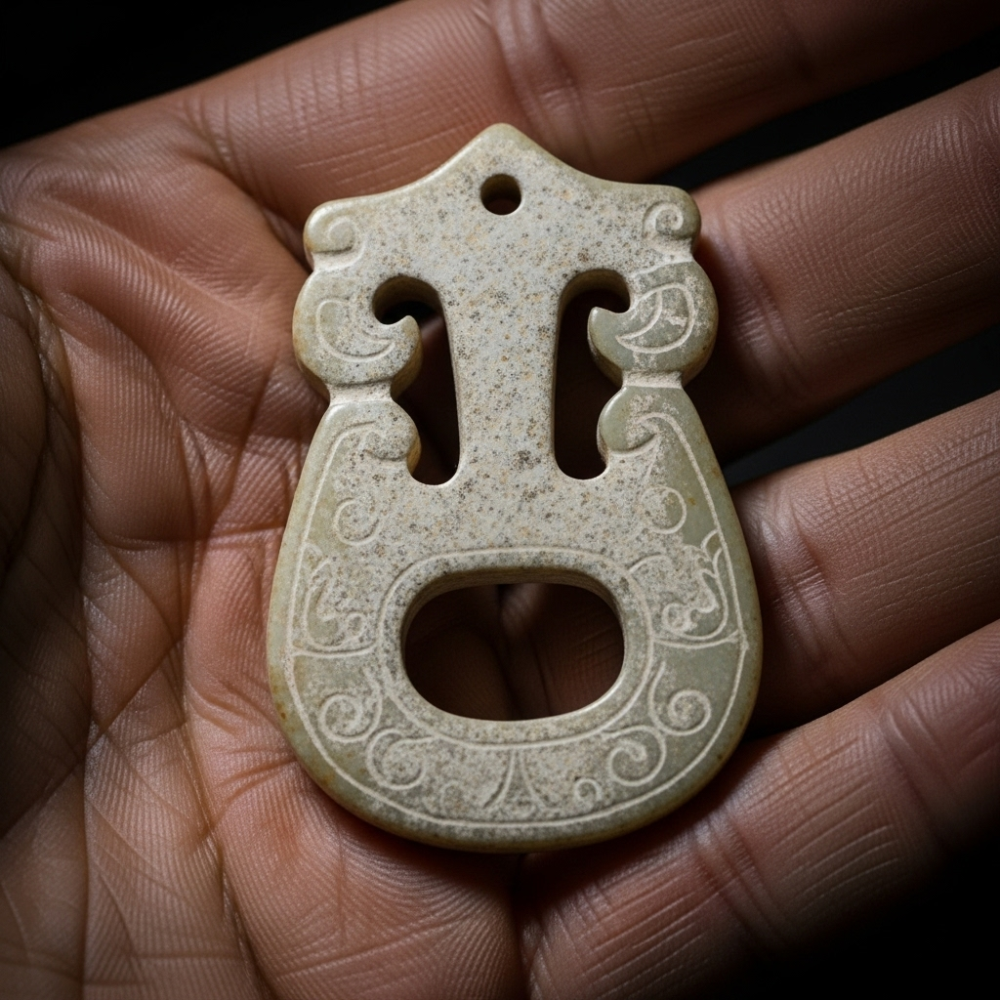

# GM手册：海棠诗社的阴影

## 1. 游戏概述

*   **故事背景：** 一个初冬的夜晚，大观园的海棠诗社再次雅集。然而，在诗会附近的假山背后，行为不端的远亲贾瑞被人发现已经气绝身亡。他的死，揭开了这座金碧辉煌的府邸之下，所隐藏的秘密与仇恨。
*   **玩家人数：** 5-7人 (包含1名GM)。
*   **游戏时间：** 约3-4小时。
*   **核心机制：** 秘密任务、伪证、情感纠葛、推理。

## 2. 故事真相

### 完整时间线

*   **申时 (16:00):** 贾环找到贾瑞，声称有办法帮他约见王熙凤，将一包他母亲赵姨娘给的“助兴”药粉（实为慢性毒药）交给贾瑞，并让他溶于酒中喝下。
*   **酉时 (18:00):** 海棠诗社夜集开始，宝玉、宝钗、薛蟠等人参与。王熙凤在附近 overseeing，林黛玉因身体不适，在不远的潇湘馆内休息。
*   **酉正 (18:30):** 贾瑞喝下毒酒，自觉身体燥热，在诗社附近徘徊，寻找王熙凤的身影。
*   **酉末 (18:45):** 喝得半醉的薛蟠与贾瑞发生口角，认为贾瑞偷看自家丫鬟，便对他推搡打骂了一番，并抢走了贾瑞身上的一块玉佩。
*   **戌时 (19:00):** 王熙凤见贾瑞仍在附近纠缠，心生厌恶，命丫鬟平儿去斥责他，并故意掉落了一块手帕，作为给贾瑞的“教训”和羞辱。
*   **戌正 (19:30):** 毒性发作，贾瑞浑身无力，头晕目眩，倒在假山背后。贾环一直躲在暗处观察，见状，上前用一块石头重击了贾瑞的后脑，确保他必死无疑，并将现场伪装成失足或遭人闷棍的样子。
*   **戌末 (20:00):** 林黛玉在潇湘馆的窗边，隐约听到假山方向传来贾环的声音，似乎在低声咒骂着什么，但并未看清。
*   **亥初 (21:00):** 晴雯奉宝玉之命去取暖手炉，抄近路经过假山，发现了贾瑞的尸体，发出惊叫。

### 凶案解析

*   **真凶：** 贾环。
*   **作案动机：** 长期被忽视和歧视，对宝玉、王熙凤等人心怀怨恨。他想借贾瑞之死，嫁祸给王熙凤或薛蟠，引发府内大乱，从而看他们的笑话，甚至希望能动摇他们的地位。
*   **作案手法：**
    1.  **下毒：** 欺骗贾瑞喝下慢性毒药，使其失去反抗能力。
    2.  **补刀：** 在贾瑞毒发后，用石头重击其后脑，此为致命伤。
    3.  **嫁祸：** 整个计划都是为了让王熙凤和薛蟠成为最大嫌疑人。

### 关键线索解析

*   **致命伤与毒药 (线索A):** 尸检会发现两��“死因”，会让玩家纠结于凶手到底是下毒的还是用钝器的。贾环同时使用了两种手段，这是他计划的核心。
*   **王熙凤的手帕 (线索B):** 这是王熙凤故意留下的，本意是羞辱贾瑞，却成了将嫌疑引向自己的关键物证。
*   **薛蟠抢走的玉佩 (线索C):** 薛蟠承认抢了玉佩，这坐实了他与死者有过激烈冲突，是强力的烟雾弹。
*   **药渣 (线索D):** 在贾瑞的酒杯中发现的药渣，经查是一种罕见的西域毒草，而赵姨娘（贾环之母）的房间里，恰好有使用这种草药的记录。
*   **林黛玉的证词 (线索E):** 她能证明贾环在案发时间点在现场附近，但她的证词很模糊（“似乎是他的声音”），会被贾环狡辩。
*   **晴雯的证词 (线索F):** 她可以证明发现尸体的时间，并证明当时附近没有别人。

## 3. 游戏流程

**第一幕：诗社惊变 (约45分钟)**
1.  GM分发`00_公共剧本.md`和各自的个人剧本。
2.  玩家阅读剧本，进行自我介绍。
3.  第一轮讨论，围绕案发情况和初步怀疑对象。
4.  **线索分发 (第一轮):** 公布【线索卡A - 官府验尸报告】和【线索卡B - 凤姐的手帕】。

**第二幕：大观园的秘密 (约90分钟)**
1.  玩家根据新线索进行讨论和一对一私聊���
2.  **线索分发 (第二轮):** 公布【线索卡C - 薛蟠的玉佩】(图片线索) 和【线索卡D - 杯中毒渣】。
3.  玩家再次进行深入讨论，矛盾将指向王熙凤、薛蟠和贾环。
4.  **线索分发 (第三轮):** 公布【线索卡E - 黛玉的证词】和【线索卡F - 晴雯的证词】。
5.  最后一轮自由讨论和指证。

**第三幕：尘埃落定 (约30分钟)**
1.  所有玩家轮流发言，陈述自己认定的凶手和理由。
2.  玩家投票，选出最终的凶手。
3.  GM公布投票结果，并揭晓故事的完整真相。
4.  GM分发每个角色的结局剧本。

## 4. 线索卡列表

*   **【线索卡A - 官府验尸报告】**
    > 死者贾瑞，后脑有钝器重击的致命伤。但其体内亦有奇毒，毒性缓慢，若无外伤，一个时辰后亦会毒发身亡。
*   **【线索卡B - 凤姐的手帕】**
    > 一方做工精美的绫罗手帕，上面绣着一只金凤，是王熙凤身份的象征。手帕在离尸体不远的草地上被发现。
*   **【线索卡C - 薛蟠的玉佩】(图片线索)**
    > 并非在现场发现。当被问及与贾瑞的冲突时，薛蟠蛮横地掏出了一块玉佩，说：“我只抢了他这块破玉，可没杀他！”
    > ****
*   **【线索卡D - 杯中毒渣】**
    > 在贾瑞倒下的地方，发现了一个摔碎的酒杯，杯底仍残留着一些有异味的药渣粉末。经查，此物与赵姨娘（贾环之母）房中小香炉里的药材成分一致。
*   **【线索卡E - 黛玉的证词】**
    > “我身子不适，未去诗会。只在窗边，仿佛听到假山那边有环哥儿的声音，像是在骂人，但风声太大，听不真切。”
*   **【线索卡F - 晴雯的证词】**
    > “我奉宝二爷的命去取手炉，抄近路从假山走，就看到了瑞大爷的尸体。我敢发誓，我到的时候，那里一个人影都没有！”

## 5. 角色配置

*   **5人局：** 去掉 `晴雯` 和 `薛蟠`。GM需扮演NPC提供线索：晴雯的证词由GM在第三轮公布；薛蟠的冲突和玉佩，由GM在第二轮以“下人目击”的形式说出。
*   **6人局：** 去掉 `晴雯`。晴雯的证词由GM在第三轮公布。
*   **7人局：** 全员参与。
