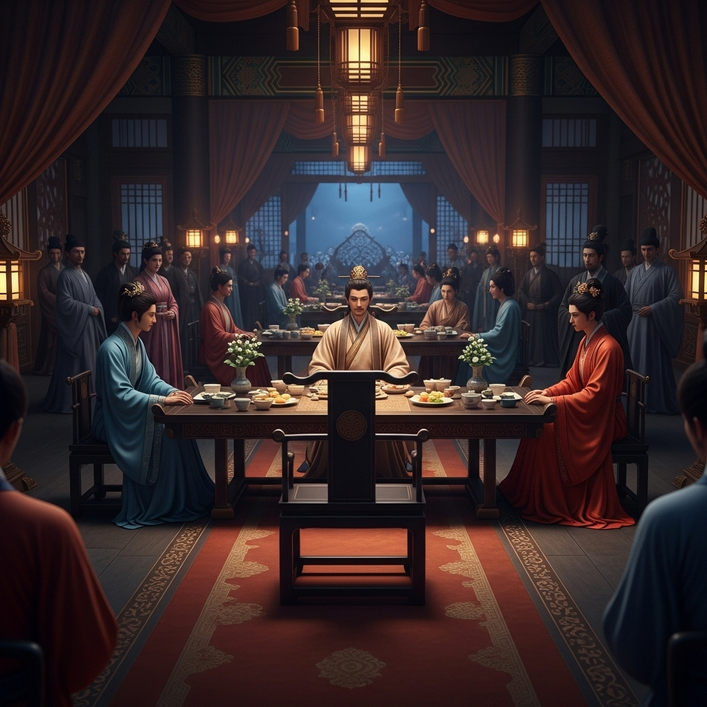

# 公共剧本：荆州宴 (v2)

## 序幕：风云际会

东汉末年，天下三分。北有曹魏，西有蜀汉，东有东吴。

荆州，这片富饶而关键的土地，如同一块肥肉，被三头猛虎觊觎。此处是三方势力的交界，是兵家必争的咽喉，也是阴谋家们表演的舞台。

荆州富商陈员外，是这片土地上的一个传奇。他靠丝绸生意发家，富可敌国。他为人八面玲珑，在三方势力之间游走，长袖善舞，据说谁能得到他的支持，谁就能在荆州的博弈中占据先机。

今夜，建安二十四年，秋。陈员外府邸灯火通明，一场盛大的寿宴正在举行。

宴会的主角，除了陈员外本人，还有几位特殊的客人：
*   **夏侯将军**：来自曹魏，据说是夏侯惇的侄子，年轻气盛，代表着曹操的意志。
*   **朱先生**：来自蜀汉，自称诸葛亮的门生，温文尔雅，深不可测。
*   **乔夫人**：来自东吴，传闻是东吴权贵的家眷，美艳动人，长于交际。
*   **华神医**：云游至此的名医，医术通神，被陈员外奉为上宾。
*   **陈月**：陈员外的独女，才貌双全，是荆州有名的美人。
*   **王管家**：陈府的老管家，侍奉陈家数十年，忠心耿耿。
*   **小舞**：陈员外请来献舞的舞女，舞姿动人。

宴会之上，觥筹交错，丝竹悦耳。然而，在这一片歌舞升平之下，是涌动的暗流。每个人都带着自己的目的，每个人的笑容背后，都可能隐藏着不为人知的秘密。

## 第一幕：血色书房

宴会进行到一半，陈员外略带醉意，称自己身体不适，要回书房休息片刻，让宾客们自便。

约半个时辰后，一声凄厉的女子尖叫划破了府邸的宁静。

众人大惊，循着声音的方向，奔向后院的书房。只见陈月小姐面色惨白地瘫倒在走廊下，手指颤抖地指向紧闭的书房门。

王管家壮着胆子，上前推开了门。

一股浓重的血腥味扑面而来。书房内，陈员外仰面倒在冰冷的地板上，双目圆睁，脸上凝固着惊恐的表情。他的胸口，赫然插着一柄华丽的匕首，鲜血染红了他华贵的寿袍。

他死了。

**【初始现场线索】**

*   **死者：** 陈员外，胸口中刀，一击致命。
*   **凶器：** 一把插在死者胸口的匕首，做工精美，非寻常之物。
*   **环境：** 书房内陈设考究，但略显凌乱。书桌上的竹简、笔墨散落一地，似乎发生过争斗。一个紫檀木盒子倒在地上��盒盖紧闭，但锁孔有被刮擦的痕跡。
*   **门窗：** 书房的门是虚掩的，任何人都可以进入。但内侧的窗户却是从里面插上了门闩，关得严严实实。

**现在，游戏开始。请各位仔细阅读自己的剧本，凶手就在你们之中。**
