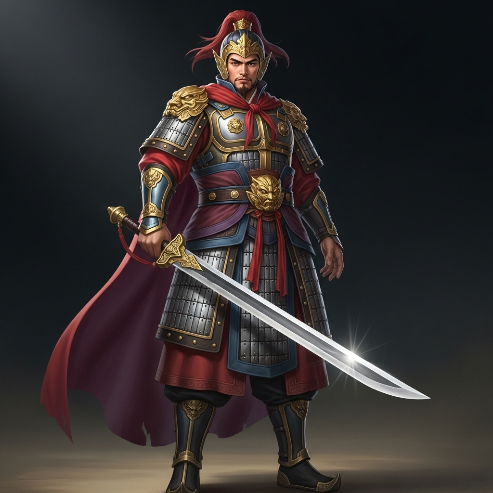

# 个人剧本：夏侯将军

## 你的身份

你是曹魏名将，夏侯惇的侄子，夏侯恩。你年轻有为，武艺高强，但性格刚烈，容易冲动。你深受曹操的信任和喜爱，此次更是被委以重任，代表丞相出使荆州。

## 你的秘密任务

你的任务只有一个：**拿到陈员外手中的《荆州布防图》**。

曹操对荆州志在必得，这份布防图详细记录了蜀汉和东吴在荆州的所有兵力部署和秘密通道，是曹魏统一大业的关键。

出发前，曹操将他随身的宝剑“青釭剑”赐予你，并告诉你，陈员外贪婪且多疑，若他不肯合作，可亮出此剑，此剑代表着丞相的意志。同时，他还给了你一把精致的匕首，这把匕首是宫中御赐之物，刀柄上刻有你的姓氏“夏”，嘱咐你关键时刻可以“便宜行事”。

## 你的时间线

*   **19:30:** 你借故邀请陈员外到书房密谈。你提出用一万两黄金购买布防图，但陈员外贪得无厌，竟索要荆州三座城池作为交换。
*   **19:40:** 你被他的贪婪激怒，认为他是在羞辱曹魏。你与他发生激烈争吵，并亮出了曹操赐予的匕首，威胁他必须交出布防图。
*   **19:45:** 陈员外见到匕首，非但没有畏惧，反而出言不逊，嘲讽曹操。你怒不可遏，上前一把将他推倒在地。他撞到书桌的边角，昏死过去。你以为他只是被你吓晕，便愤然离去，想让他自己清醒清醒。匆忙之间，你将那把刻有“夏”字的匕首遗落在了书桌上。
*   **19:45 - 20:20:** 你回到宴会厅，一个人坐在角落喝着闷酒，心中盘算着如何向曹操复命。你没有再离开过座位，直到听到尖叫声。

## 你的任务目标

1.  **首要目标：洗脱自己的杀人嫌疑。** 你虽然动了手，但你确信自己离开时陈员外只是晕了过去。有人在你之后进入书房，用你的匕首杀了他，并嫁祸给你。
2.  **次要目标：找到真正的凶手。** 找出那个敢于嫁祸曹魏的人，将他碎尸万段。
3.  **最终目标：完成曹操的任务，找到《荆州布防图》。** 你怀疑布防图就藏在那个紫檀木盒子里。

## 你知道的线索

*   凶器是你的匕首，上面有你的姓氏。这是对你最不利的证据。
*   你与死者在案发前有过激烈的争吵和肢体冲突，很多人可能都听到了。
*   你离开时，书房的门是虚掩的，窗户是开着的。
*   你坚信自己不是凶手，一定有其他人进入过书房。

---
## 结局

**（游戏结束后，GM会告诉你是否成功完成任务，然后阅读此部分）**

**如果真凶被找出：**
> 虽然洗脱了杀人嫌疑，但你办事不力，不仅丢失了丞相御赐的匕首，还未能取得布防图，最终导致曹魏错失了攻取荆州的最佳时机。你被曹操严厉斥责，削去官职，郁郁而终。

**如果真凶不是你，但你被冤枉：**
> 你百口莫辩，被愤怒的众人围攻。尽管你武艺高强，但双拳难敌四手。在蜀汉和东吴势力的联合施压下，你被当做凶手处死。你的死，成为了曹操挥军南下的绝佳借口，荆州之战，就此爆发。

**如果你成功找到了布防图：**
> 在混乱中，你设法打开了紫檀木盒子，找到了那份至关重要的《荆州布防图》。你带着它连夜逃出荆州，回到许昌。曹操大喜，你将功补过，被封为大将军。不久之后，曹魏大军依靠布防图，成功夺取了荆州。
