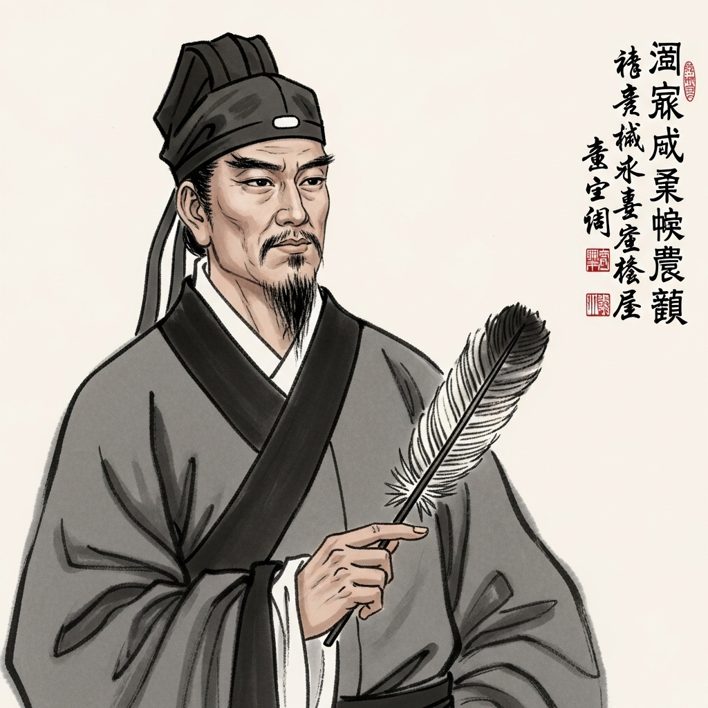

# 个人剧本：朱先生

## 你的身份

你是蜀汉丞相诸葛亮的亲传弟子，朱辰。你受命代表蜀汉势力，前来荆州与陈员外结盟。你风度翩翩，智计过人，深得诸葛丞相的真传。

## 你的秘密任务

你的任务是：**拿到曹操写给陈员外的密信，并说服陈员外与蜀汉结盟。**

你得到情报，陈员外手中有一封曹操的亲笔信，信中详细阐述了曹魏未来一年内进攻荆州、吞并蜀汉的完整计划。这份情报对蜀汉的生死存亡至关重要。同时，你需要利用这份密信，揭露曹操的阴谋，迫使陈员外彻底倒向蜀汉。

## 你的时间线

*   **19:45:** 你在宴会厅看到夏侯将军怒气冲冲地从后院方向回来。你心知他必定是与陈员外谈崩了，这正是你的机会。
*   **19:50:** 你借口更衣，悄悄来到书房附近。你看到书房的门虚掩着，便从门缝向内窥探。你看到陈员外倒在地上，一动不动，但距离太远，你并未看到他身上的匕首，只以为他是被打晕或气晕了。
*   **19:51:** 你认为这是天赐良机，可以潜入书房寻找密信。但你为人谨慎，担心这是夏侯将军设下的圈套。你决定暂��不打草惊蛇，先退回宴会，静观其变。
*   **19:55 - 20:20:** 你回到宴会厅，与乔夫人等人闲聊，暗中观察着每一个人的动向。你没有再离开过座位，直到听到尖叫声。

## 你的任务目标

1.  **首要目标：隐藏自己曾到过案发现场附近的事实。** 在局势明朗前，暴露自己可能会让你成为嫌疑人，打乱你的计划。
2.  **次要目标：借他人之手，找出真相。** 你需要引导众人进行调查，利用他们的发现来拼凑出对你有利的局面。你怀疑是夏侯将军杀人，但他行事如此粗糙，让你感到一丝不安。
3.  **最终目标：找到曹操的密信。** 这关系到蜀汉的未来，你必须得到它。你猜测密信就在书房的某个地方，甚至可能就在那个紫檀木盒子里。

## 你知道的线索

*   你亲眼看到夏侯将军在案发时间点从书房方向愤怒地离开。他是第一嫌疑人。
*   你看到过陈员外倒地，可以佐证死亡时间。
*   你行事缜密，没有留下任何脚印或证据。
*   你怀疑夏侯将军的动机，也怀疑这背后是否有更深的阴谋。

---
## 结局

**（游戏结束后，GM会告诉你是否成功完成任务，然后阅读此部分）**

**如果真凶被找出：**
> 案件水落石出，你趁乱在书房中��到了那封曹操的密信。你成功揭露了曹魏的阴谋，陈员外的继承者彻底倒向蜀汉。回到成都后，你被诸葛丞相大力褒奖，认为你深得其真传，前途无量。

**如果你被冤枉：**
> 你的谨慎让你错失了最佳时机，反而因为你曾出现在现场附近而备受怀疑。在曹魏和东吴的联手施压下，你被当做替罪羊。你的死，让蜀汉在荆州的布局彻底失败。

**如果你拿到了密信，但凶手未被找出：**
> 虽然你完成了任务，但荆州的局势因为这桩悬案而变得极度混乱。你带着密信回到蜀汉，虽然为蜀汉争取了宝贵的备战时间，但荆州的盟友已经失去，蜀汉的北伐之路变得更加艰难。
