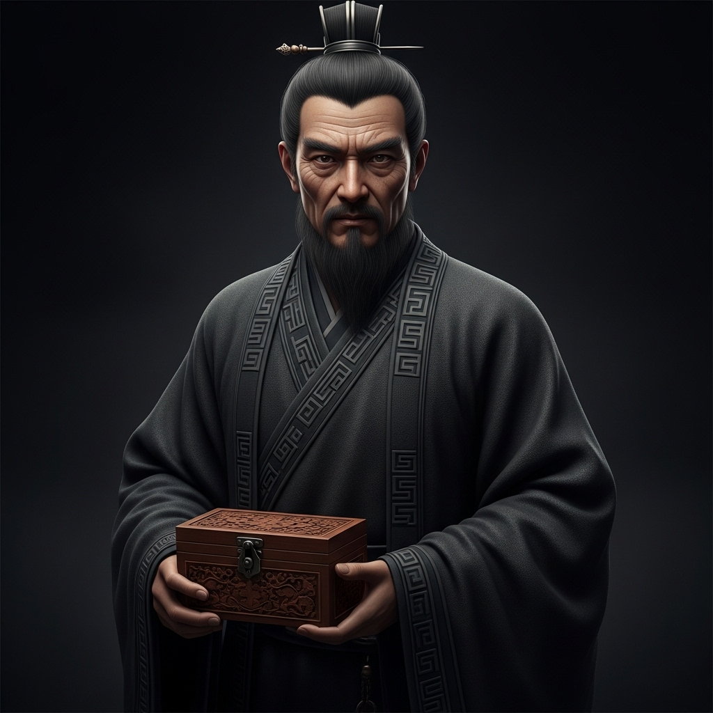

# 个人剧本：华神医 (v2)

## 你的身份

你是一位技艺高超的隐世名医，华玄。你表面上云游四方，悬壶济世，实际上，你的心中埋藏着血海深仇。

## 你的秘密任务

你的任务是：**杀死曹操的爪牙，为你的家族复仇。**

你的真实身份，是东汉末年神医华佗的族人。当年华佗因为要为曹操开头颅治病，被多疑的曹操下令处死，你的家族也因此受到牵连，几乎被灭门。你侥幸逃生，隐姓埋名，苦练医术和毒术，只为有朝一日能向曹操复仇。

你得知曹操的爱将夏侯将军会来赴宴，一个完美的复仇计划在你心中成型。你早已查明，陈员外患有心悸之症，长期服用你给他开的“调理”汤药。

## 你的时间线

*   **18:00 (宴会前):** 你在给陈员外准备的每日汤药中，加入了致命的“乌头”之毒。这种毒会与他日常服用的药物相冲，形成剧毒，能在一个时辰内让他“心脏病发”而死，死状天衣无缝。你算准了时间，他会在宴会进行到一半时毒发身亡。
*   **18:00 - 20:20:** 你一直在宴会厅中，一边品尝着美酒，一边等待着毒发的那一刻。你计划等陈员外死后，利用你神医的身份进行“尸检”，将死因归咎于他自身疾病，然后 subtly 地暗示，是夏侯将军的到来“刺激”到了他，从而将脏水泼向曹魏。
*   **20:20 (案发):** 然而，当你们赶到书房，你惊愕地发现，陈员外竟然是被人用匕首杀死的！这完全打乱了你的计划。你不知道是谁破坏了你的复仇，但你也意识到，这或许是一个更好的机会，一个能将夏侯将军彻底钉死在凶手位置上的机会。

## 你的任务目标

1.  **首要目标：隐藏你曾对陈员外下毒的事实。** 这是你的核心秘密，一旦暴露，你将万劫不复。
2.  **次要目标：利用你的医学知识，将嫌疑引向夏侯将军。** 你可以在尸检时，故意夸大刀伤的致命性，淡化中毒的迹象，或者将中毒解释为其他原因，总之，你的“专业”判断将是引导舆论的关键。
3.  **最终目标：完成你的复仇。** 无论真凶是谁，你都要确保夏侯将军为这起谋杀案负责。

## 你知道的线索

*   你对死者下过毒，但他的直接死因是刀伤。
*   作为唯一的医生，你拥有定义“死亡原因”的权力。你可以通过尸检报告（线索卡A）来误导所有人。你可以说“虽然有中毒迹象，但不足以致命，真正的死因是这一��”。
*   你知道夏侯将军代表曹操，你有强烈的动机嫁祸于他。
*   破坏你计划的真凶，是你的敌人，但也可能是你可以利用的棋子。

---
## 结局

**（游戏结束后，GM会告诉你是否成功完成任务，然后阅读此部分）**

**如果夏侯将军被指认为凶手：**
> 你的复仇成功了。曹操的爱将被当众处死，曹魏颜面尽失，你在暗中品尝着复仇的快感。事了之后，你悄然离开荆州，继续寻找下一个复仇目标。江湖上，少了一个华神医，多了一个在暗中对抗曹魏的影子。

**如果你下毒之事暴露：**
> 你的秘密被揭开，你瞬间从一个受人尊敬的神医，变成了阴险的下毒者。无论你如何辩解，你都无法洗脱自己的嫌疑。最终，你被众人视为与凶手同罪的恶人，被乱棍打死，结束了你悲剧性的一生。

**如果真凶被找出，且不是夏侯将军：**
> 你的复仇失败了。虽然你没有暴露，但看着夏侯将军安然无恙地离开，你心中充满了不甘。你意识到，孤身一人的复仇之路，远比想象中更加艰难。你离开了荆州，背影充满了萧索。
