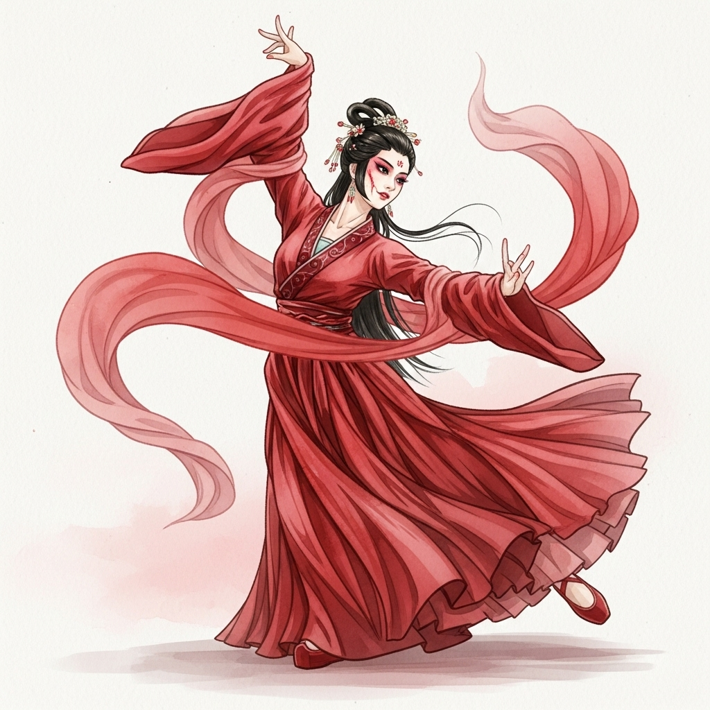

# 个人剧本：小舞 (v2 - 可选角色)

## 你的身份

你是被请来宴会上献舞的舞女，小舞。你舞姿曼妙，容貌秀丽，是今晚宴会上的一道亮丽风景。在所有人看来，你只是一个无关紧要的、增添气氛的表演者。

## 你的秘密

你的野心远不止一个舞女。你渴望摆脱低贱的身份，飞上枝头变凤凰。

你早已被陈员外看中，并与他有了一段私情。他向你许诺，只要你今晚能让他满意，他就会为你赎身，纳你为妾。你为此精心准备，希望能在今晚彻底俘获他的心。

然而，陈员外只是把你当做一个玩物。他还拍下了你的一幅“半裸画像”，并以此威胁你，让你在宴会上为他做一些“特别”的表演来取悦贵客。你感到深受屈辱，但又不敢反抗。你对陈员外充满了又爱又恨的复杂情感。

## 你的时间线

*   **19:00 - 20:15:** 你一直在宴会厅中央的舞池里跳舞。你的位置视野很好，可以看到大部分宾客的动向，但因为要专心跳舞，你只能看到一些模糊的片段。
*   **19:30左右:** 你看到夏侯将军和陈员外一前一后离开了宴席，走向后院。
*   **19:45左右:** 你看到夏侯将军一个人黑着脸回来了。
*   **20:00左右:** 在一曲舞毕，你稍作休息，准备换上下一套更“特别”的服装时，你无意中瞥见陈月小姐端着一个茶盘，脚步匆匆地走向后院的书房方向。你当时觉得有些奇怪，但并未多想。
*   **20:18左右:** 你换好衣服，正准备再次登台，突然看到陈月小姐的身影从后院方向惊慌失措地跑过，似乎在极力忍耐着什么。紧接着，没过多久，你就听到了她凄厉的尖叫声。

## 你的任务目标

1.  **首要目标：隐藏你与陈员外的私情以及被他威胁的秘密。** 这段关系并不光彩，一旦暴露，你可能会被视为因爱生恨或因羞辱而杀人的嫌疑人。
2.  **次要目标：保护自己，远离嫌疑。** 你是一个弱女子，在这场权力的游戏中，任何一点怀疑都可能让你万劫不复。你需要装作什么都不知道。
3.  **最终目标：找到那幅对你不利的画像并销毁它。** 陈员外死了，这是你摆脱控制的唯一机会。你猜测画像就藏在他的书房里。

## 你知道的线索

*   你知道陈员外是个好色之徒，除了你，他可能还有别的情人。
*   你看到了关键的时间线：你看到陈月���案发前去了书房，并在尖叫前看到了她惊慌跑开的身影。这是指证真凶的决定性证据。但是，说出这个证据，也可能会暴露你对现场的过分关注，让你自己陷入危险。是否以及何时说出这个线索，将是你最大的考验。
*   你可以利用你的弱者身份，博取他人的同情和保护。

---
## 结局

**（游戏结束后，GM会告诉你是否成功完成任务，然后阅读此部分）**

**如果真凶被找出，而你未被怀疑：**
> 你在混乱中，趁机溜进书房，找到了那幅让你蒙羞的画像，付之一炬。随着案件的了结，你重获自由。你用陈员外私下赠予你的一些财物，为自己赎了身，离开了这个是非之地，开始了一种全新的、属于自己的生活。

**如果你被冤枉为凶手：**
> 你与陈员外的私情被人揭露，你成为了因爱生恨的最佳嫌疑人。无论你如何辩解，一个卑微舞女的证词，在这些达官贵人面前都显得那么无力。你最终香消玉殒，成了又一个权斗的牺牲品。

**如果你说出了关键线索，但自己也陷入麻烦：**
> 你指证了陈月，虽然最终帮助大家找到了真凶，但你自己与陈员外的关系也因此曝光。你虽然洗脱了杀人嫌疑，却也身败名裂，再也无法在���州立足，只能黯然离去。
