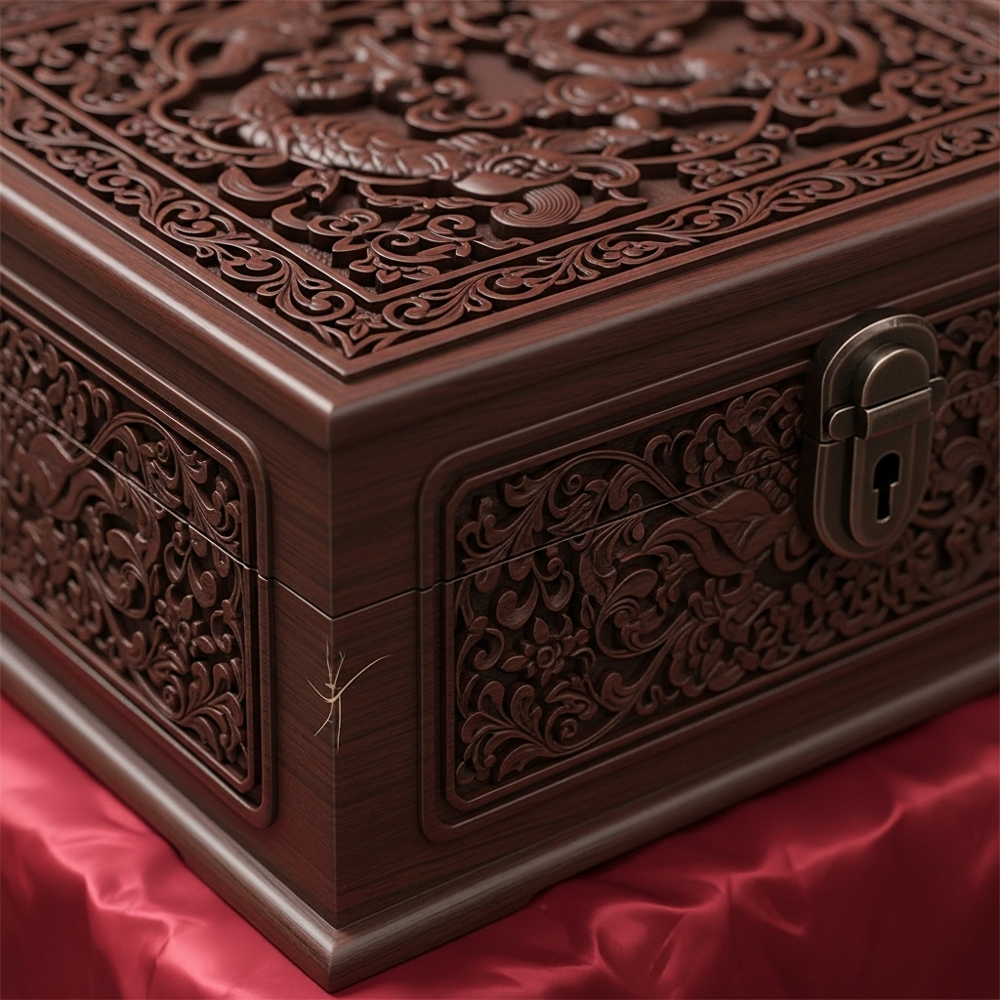

# GM手册：荆州宴

## 游戏概述

这是一个以三国时代为背景的7人剧本杀游戏（5核心+2可选）。玩家将扮演卷入荆州富商陈员外谋杀案的嫌疑人，通过调查、推理和隐藏自己的秘密，最终找出真凶。

*   **游戏人数：** 5-7人 (包含1名GM)
*   **游戏时间：** 约3-4小时
*   **核心机制：** 推理、角色扮演、秘密任务

## 故事真相

**1. 完整时间线：**

*   **18:00 (宴会前):** 华神医将下了“乌头”之毒的汤药交给陈府下人，让其送给陈员外。
*   **19:00 (宴会开始):** 众人入席。小舞开始献舞。
*   **19:30:** 陈员外邀请夏侯将军到书房密谈。
*   **19:45:** 夏侯将军与陈员外因“荆州布防图”之事发生激烈争吵，夏侯将军将陈员外推倒在地，并将曹操御赐的匕首遗落在书房，愤然离去。王管家在远处听到了争吵声。
*   **19:50:** 朱先生看到夏侯将军离开，心生疑窦，悄悄靠近书房，从门缝中窥见陈员外倒地，但未看到匕首，以为只是晕倒。他为了拿到曹操密信，决定暂时不动声色，悄然退走。
*   **19:55:** 乔夫人躲在假山后，看到夏侯将军离开，进入书房想取回自己的情书。她发现陈员外已死（被夏侯将军推倒时撞到桌角，暂时昏死过去，但乔夫人误以为已死），惊慌之下在抽屉里找到情书。
*   **20:00:** 乔夫人正欲离开，听到门外有脚步声（是陈月前来），慌乱中从内部锁上窗户，翻窗逃走。
*   **20:01:** 陈月端着下了迷药的安神茶进入书房，发现父亲只是昏迷。她假意唤醒父亲，让他喝下安神茶。
*   **20:10:** 陈员外在迷药作用下沉睡。陈月从他怀中偷走紫檀木盒的钥匙，打开盒子，取走了母亲的地契和信物。
*   **20:15:** 陈员外突然醒来（迷药剂量不够或其体质特殊），发现陈月的行为，勃然大怒，辱骂并企图殴打她。
*   **20:16 (真正的死亡时间):** 陈月在极度恐惧和愤怒中，看到了桌上的匕首，抓起它刺向了陈员外，一击致命。
*   **20:18:** 陈月将现场伪装成打斗过的样子，将钥匙放回父亲身上，跑出书房，故意在走廊尽头尖叫，吸引众人注意。小舞在远处看到了陈月跑出的身影。
*   **20:20 (尸体发现):** 众人赶到案发现场。

**2. 真凶及动机：**

*   **真凶：** 陈月。
*   **动机：** 为母复仇+自我防卫。陈员外害死了她的母亲，并长期对她进行精神控制。她本只想偷回属��母亲的遗物，但被父亲发现后，在暴力威胁下失手杀人。

**3. 关键线索解析：**

*   **凶器（匕首）：** 夏侯将军所有，是嫁祸他的关键。
*   **锁住的窗户：** 乔夫人所为，制造了密室的假象，也让她自己有了嫌疑。
*   **毒药：** 华神医所下，但并非致命原因。尸检会发现中毒迹象，让华神医陷入嫌疑。
*   **紫檀木盒子：** 锁孔有撬动痕迹是陈月伪造的，钥匙一直在陈员外身上，暗示是熟人作案。盒子里本应有的地契消失了，这是陈月作案的根本目的。

## 游戏流程

**第一幕：案发之初 (约45分钟)**

1.  GM向玩家分发`00_公共剧本.md`和各自的个人剧本。
2.  玩家阅读剧本，约15分钟。
3.  玩家以角色身份进行自我介绍。
4.  第一轮讨论：根据公共剧本和个人剧本的初始信息进行讨论。
5.  **线索分发 (第一轮):** GM向所有玩家公布【线索卡A】和【线索卡B】。

**第二幕：深入调查 (约90分钟)**

1.  玩家根据新线索进行讨论和一对一私聊。
2.  **线索分发 (第二轮):** GM向所有玩家公布【线索卡C】和【线索卡D】。
3.  玩家再次进行讨论，此时已有足够信息锁定几个关键嫌疑人。
4.  **线索分发 (第三轮):** GM向所有玩家公布���线索卡E】和【线索卡F】。
5.  最后一轮自由讨论和指证。

**第三幕：真相大白 (约30分钟)**

1.  所有玩家轮流发言，陈述自己认定的凶手和理由。
2.  被指认的玩家进行最后的辩解。
3.  所有玩家投票，选出最终的凶手。
4.  GM公布投票结果，并揭晓故事的完整真相。
5.  GM分发每个角色的结局剧本（包含在个人剧本的最后部分），让玩家阅读，了解自己角色的最终命运。

## 线索卡

**【线索卡A - 尸检报告】(由华神医公布)**
> 死者胸口刀伤深可见骨，是致命伤。但死者面色发紫，嘴唇发黑，有明显中毒迹象。毒素为“乌头”，若无刀伤，此毒半个时辰内亦可致命。死亡时间约在一炷香之前。

**【线索卡B - 匕首】(现场物证)**
> 一把极其华丽的匕首，刀柄上刻有一个模糊的“夏”字。经夏侯将军辨认，确为其所有，是曹操所赐，不慎遗落在书房。

**【线索卡C - 窗户】(现场环境)**
> 书房的窗户从内部锁上，没有被破坏的痕迹。窗外的泥地上，有一个模糊的、尺寸较小的脚印，似乎有人从这里翻出。

**【线索卡D - 王管家的证词】(NPC证词)**
> “老爷半个时辰前，确实和夏侯将军在书房大吵了一架，好��是为了什么‘图’。后来将军怒气冲冲地走了。之后……之后我看到乔夫人曾在书房附近徘徊，鬼鬼祟祟的。”

**【线索卡E - 小舞的证词】(NPC证词)**
> “奴家在远处跳舞时，看到陈月小姐端着一壶茶进了书房。过了许久，才看到她惊慌失措地跑出来，然后才发出尖叫。”

**【线索卡F - 紫檀木盒子】(现场物证)**
> 盒子是锁着的，钥匙也在老爷身上。但盒子底部有一条细微的划痕，似乎是被人拖动过。盒子比想象中要轻，打开后（需找到陈月身上的钥匙），会发现里面只有几件不值钱的旧首饰，与传闻中的珍宝不符。
>  ## 角色配置

*   **5人局：** 去掉 `王管家` 和 `小舞`。GM需要自己扮演NPC，在第二幕提供【线索卡D】和【线索卡E】的证词。
*   **6人局：** 去掉 `小舞`。让 `王管家` 玩家加入。
*   **7人局：** 全员参与。
