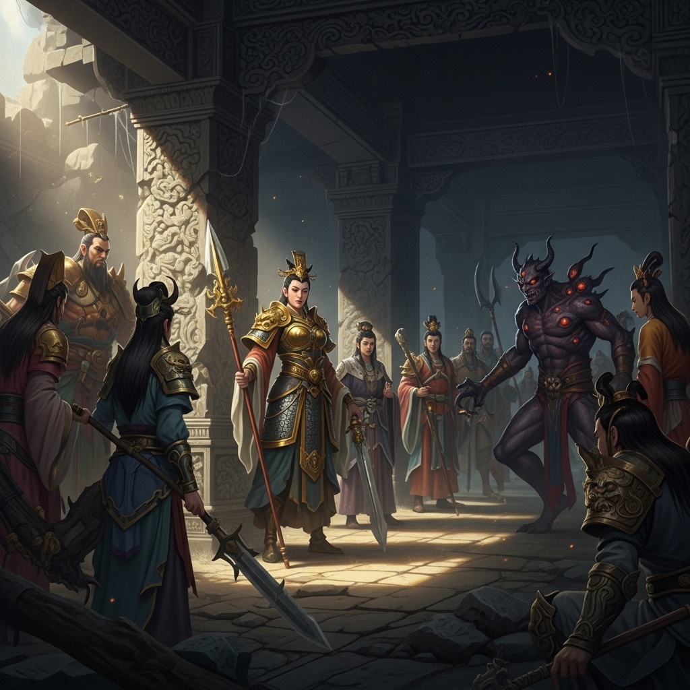

# 公共剧本：真假白骨精

## 序幕：圣僧逐徒

西牛贺洲，白虎岭。

唐三藏师徒四人西行至此，遭遇了善于变化的白骨夫人。那妖精三次变幻为凡人，都被火眼金睛的孙悟空识破，三次棒打，使其元神大伤，狼狈逃窜。

然而，肉眼凡胎的唐三藏却只看到自己的大徒弟滥杀无辜，罪孽深重。他不顾猪八戒的挑唆和沙和尚的劝解，执意念起紧箍咒，惩罚悟空。最终，一纸贬书，将这位神通广大的齐天大圣，逐出了西行的队伍。

孙悟空含泪拜别，化作一道金光，消失在天际。

队伍中，八戒暗自窃喜，沙僧默然不语，唐僧则长吁短叹，心中五味杂陈。

## 第一幕：山神庙疑案

傍晚，师徒三人为避风寒，来到白虎岭深处的一座破败的山神庙中借宿。

庙宇之内，蛛网遍结，香案蒙尘。然而，令人惊骇的是，在神像前的蒲团上，竟端坐着一具“尸体”。

那尸体身着道袍，面容安详，仙风道骨，不似凡人，倒有几分像传说中白骨精化作的仙人模样。但奇怪的是，他身上毫无妖气，反而隐有霞光流转。

众人大惊失色，不知所措。这究竟是��方神圣？为何会在此坐化？这真的是白骨精吗？

就在此时，自称奉玉帝之命下凡调停的太白金星飘然而至；一位自称被恶人打伤的柔弱“村姑”也前来求助；更有附近的妖王黄袍怪和此地土地公闻讯而来。

小小的山神庙，一时之间，神、人、妖、魔，齐聚一堂。气氛诡异到了极点。

**【初始现场线索】**

*   **死者：** 一位身着道袍的仙人，盘坐于蒲团之上，已无声息。
*   **环境：** 破败的山神庙，除了“死者”外，并无打斗痕迹。
*   **人物：** 唐僧、猪八戒、沙和尚，以及随后到来的太白金星、村姑（白骨精）、黄袍怪、土地公，皆在现场。

**太白金星（或由GM扮演）拂尘一摆，朗声道：“此事蹊跷，恐有天大的阴谋。在查明真相之前，各位都难脱干系！”**

**现在，游戏开始。请各位仔细阅读自己的剧本。**
