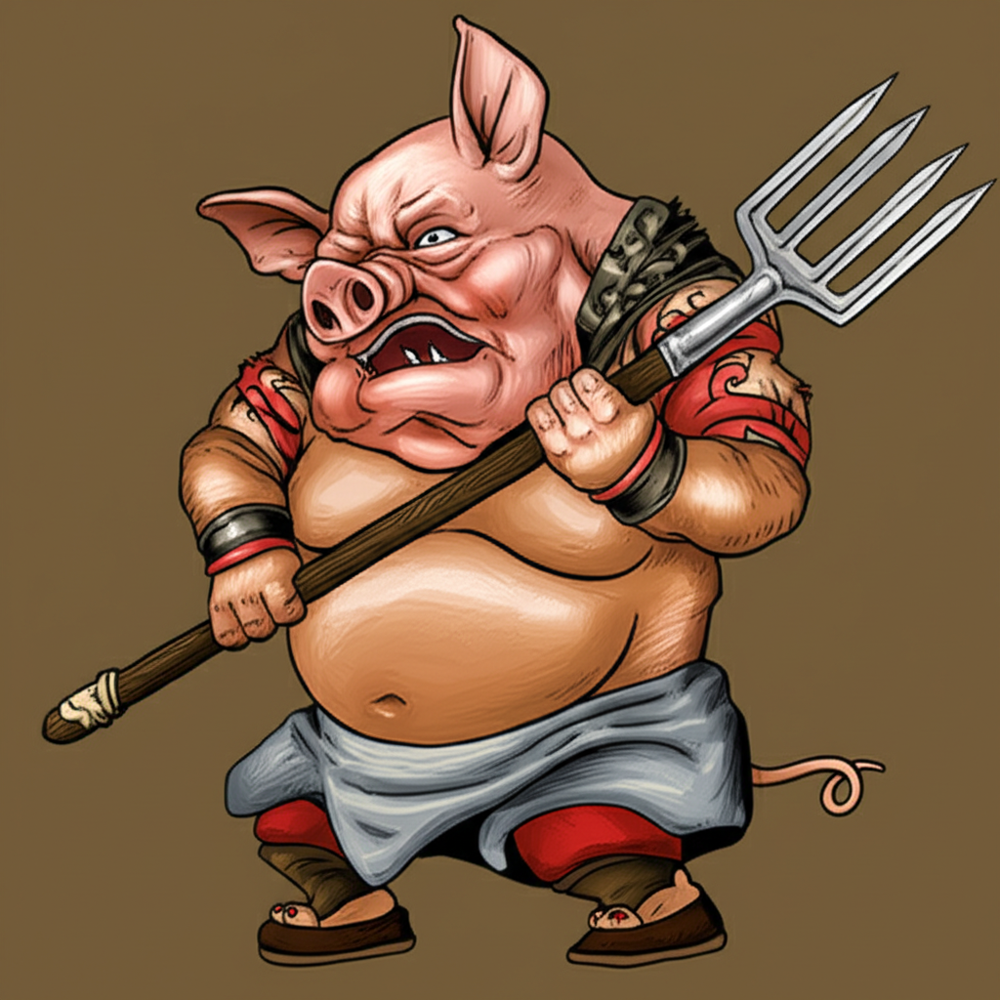

# 个人剧本：猪八戒 (天蓬元帅)

## 你的身份

你是猪八戒，曾经是天庭掌管十万天河水兵的天蓬元帅，因为调戏嫦娥被贬下凡，错投了猪胎。你贪吃、好色、懒惰，但也保留了一些小聪明和自私的“智慧”。

## 你的秘密

你并非真心想赶走孙悟空，你的挑拨离间，其实是为了自保。

你偷吃了万寿山人参果，欠了孙悟空一个天大的人情。但你心里清楚，以孙悟空的性格，他早晚会拿这件事来要挟你、使唤你。为了摆脱这个“把柄”，你才想借唐僧之手，暂时将他赶走。你心想，等西天取经功成，你成了佛，还怕他一个猴子？

今晚，在山神庙外，你第一个发现了那具“尸体”。你见他仙风道骨，衣着不凡，便起了贪念，想从他身上顺走点值钱的东西。你上前拉扯他的衣袖，想把他袖中的法宝或银两掏出来，结果不小心把他的袖子给撕破了。你吓了一跳，什么也没敢拿，赶紧回到了队伍里。

你不知道这人是真死还是假死，但你撕破他衣服的事情，绝对不能让别人知道。

## 你的时间线

*   **下午：** 你成功挑拨离间，让唐僧赶走了孙���空，心中暗喜。
*   **酉正 (18:30):** 你在庙外放哨时，第一个发现了“尸体”，并上前偷窃，撕破了他的袖子。
*   **戌时 (19:00):** 你假装和师父、师弟一起“首次”发现尸体，并大呼小叫。
*   **之后：** 你极力将所有嫌疑都推到“妖精”身上，以掩盖自己的行为。

## 你的任务目标

1.  **首要目标：隐藏你撕破尸体袖子，并企图偷窃的事实。** 这是你的死穴，一旦暴露，你跳进黄河也洗不清。
2.  **次要目标：搅乱局势，将水搅浑。** 你要不断地提出各种不靠谱的猜测，比如“这肯定是那猴子杀的，故意嫁祸给我们！”，或者“这肯定是哪个神仙的亲戚，我们惹上大麻烦了！”，让大家无法集中精力思考。
3.  **最终目标：保全自己，继续享受“没有大师兄”的快乐旅程。**

## 你知道的线索

*   你是第一个接触尸体的人，你知道他当时身上是冰冷的，但没有僵硬。
*   你撕破的袖子，是对你最不利的证据。
*   你可以利用唐僧对你的信任，不断地进谗言，影响他的判断。

---
## 结局

**如果你成功隐藏了秘密：**
> 你靠着自己的小聪明和和稀泥的本事，成功地蒙混过关。虽然队伍里发生了命案，但你毫发无损。在���有大师兄的日子里，你过得逍遥自在。直到下一次劫难的来临。

**如果你的行为被揭露：**
> 你的偷窃行为被公之于众。唐僧对你大失所望，虽然没有将你逐出师门，但对你的信任已降到冰点。你在队伍里的地位变得岌岌可危，时常要被沙和尚数落，苦不堪言。
