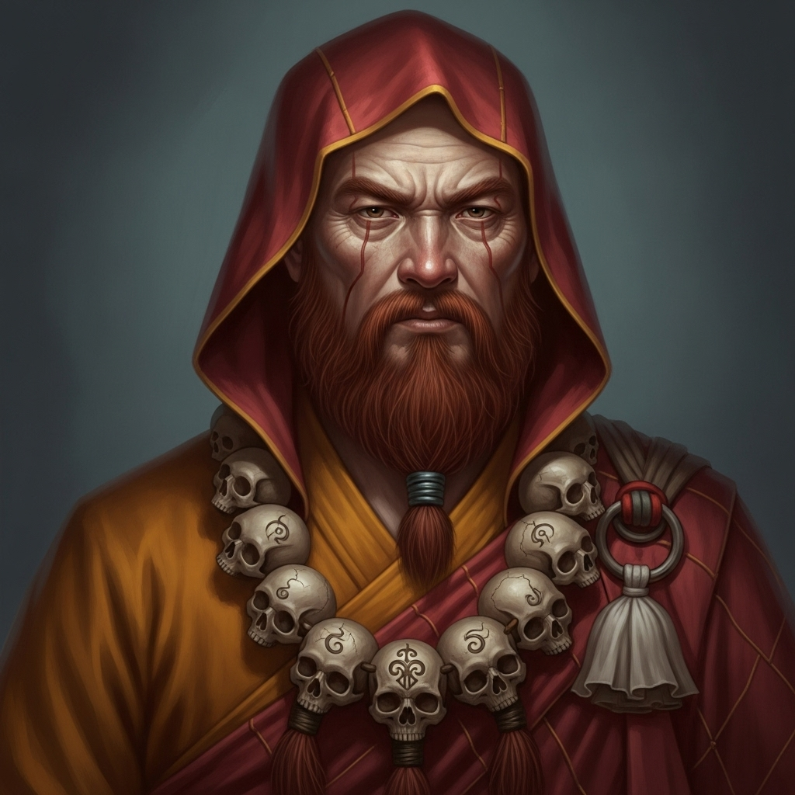

# 个人剧本：沙和尚 (卷帘大将)

## 你的身份

你是沙和尚，曾经是天庭的卷帘大将，因在蟠桃会上失手打碎了琉璃盏，被贬下凡，在流沙河为妖。后被观音菩萨点化，拜唐僧为师。你为人忠厚老实，任劳任怨，是队伍里最沉默寡言的一个。

## 你的秘密

**你就是杀死山神庙中那名“仙人”的真凶。**

你的沉默，是因为你心中藏着血海深仇。你被打下流沙河后，曾有几位同样被贬的神仙与你结为兄弟，一同修行，希望能早日修成正果。但后来，一个法力高强的妖道霸占了流沙河附近的地盘，为了抢夺你们的修行成果，害死了你的所有师兄弟，只有你一人侥幸逃脱。

那个妖道的法宝，正是一柄拂尘。

今天，当你在山神庙看到这具“尸体”时，你一眼就认出了他——正是当年害死你兄弟们的那个妖道！他不知用了什么法子，竟修得了一副仙风道骨的模样，还当上了此地的“山神”。

你看到他虽然没了呼吸，但体内似乎还有微弱的生机，你明白他是在假���。你意识到，这是你报仇的唯一机会。

在众人互相猜忌、乱作一团时，你走上前去，假意检查尸体。你将手搭在他的胸口，暗中催动你“卷帘大将”的神力，用一股暗劲，瞬间震碎了他的心脉。

你报了仇，但你的心中，充满了不安。

## 你的时间线

*   **下午：** 孙悟空被赶走，你虽然劝解，但并未尽全力。因为你心中有事，不希望被神通广大的大师兄看穿。
*   **戌时 (19:00):** 你进入山神庙，立刻认出了你的仇人。
*   **亥正 (21:30):** 你趁着混乱，上前“检查”尸体，并用暗劲杀死了他。

## 你的任务目标

1.  **首要目标：你是凶手。你的唯一任务就是隐藏自己，不被任何人发现。** 你要利用你忠厚老实的形象，让所有人都不会怀疑你。
2.  **次要目标：将嫌疑引向他人。** 你可以暗示是妖精内斗（白骨精或黄袍怪），或者是天庭的阴谋（太白金星）。
3.  **最终目标：守护师父，完成取经大业。** 你报了私仇，现在你只想安安稳稳地保护师父，取得真经，修成正果，以告慰你兄弟们的在天之灵。

## 你知道的线索

*   你知道完整的作案手法，手法极其隐蔽，只有精通内劲的神仙或妖魔才能察觉。
*   你知道死者是个披着仙人外衣的妖道。你可以适时地透露出“此人身上似乎有邪气”，来误导他人。
*   你看到死者的指甲里，似乎有一些奇怪的沙土。你心中一惊，那是你家乡流沙河的沙子，可能是当年打斗时留下的。这是对你最危险的线索。

---
## 结局

**如果你成功逃脱：**
> 没有人怀疑到你这个最忠厚的老实人身上。你成功地报了血海深仇，并继续以一个忠心耿耿的挑担人形象，保护着师父西行。你的秘密，永远地埋藏在了白虎岭的这座山神庙里。

**如果你的罪行被揭露：**
> 你的行为最终还是被揭露了。众人无法相信，这个最老实的人，竟然会是心机深沉的凶手。唐僧对你既痛心又害怕，虽然没有将你赶走，但师徒之间的信任已经荡然无存。你的取经之路，变成了一场漫长的赎罪。
