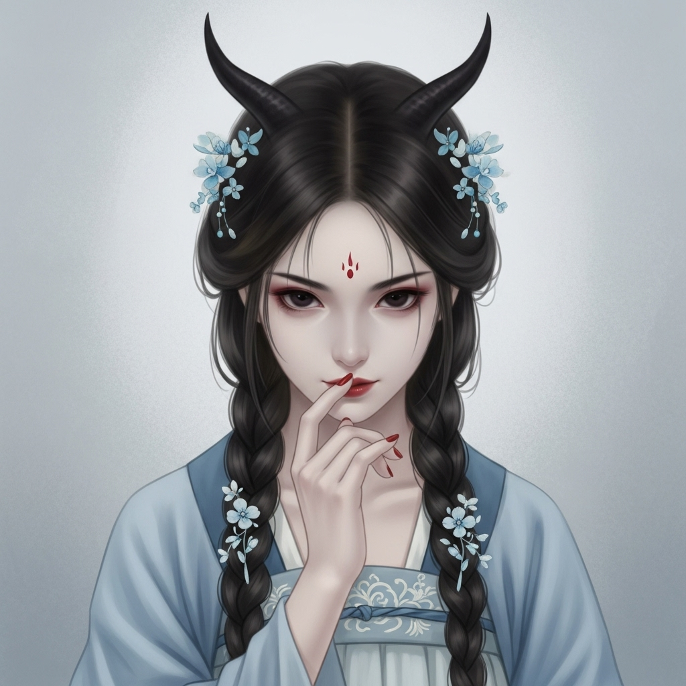

# 个人剧本：白骨夫人 (尸魔)

## 你的身份

你是白虎岭的妖王，白骨夫人。你本是一堆白骨，因采集天地灵气而修炼成精。你善于变化和伪装，为了吃唐僧肉以求长生不老，你设下了“三打白骨精”之计。

## 你的秘密

你虽然是妖精，但你不是杀人凶手。你现在非常虚弱，并且正在扮演一个无辜的受害者。

今天上午，你的三次变化都被孙悟空识破，元神被他的金箍棒打得几乎溃散。你拼尽最后一丝力气，才逃回洞府，保住一命。

你花了半天时间，才勉强恢复了一些元气。你心有不甘，想知道唐僧师徒的动向。你变化成一个被猎人打伤的柔弱村姑，一路哭哭啼啼地来到了山神庙，想博取唐僧的同情，再图后计。

可你一进庙，就惊呆了——庙里竟然有一具“你”的尸体！

那尸体虽然仙风道骨，但容貌竟和你变化出来的仙人模样有七八分相似。你立刻意识到，有人在冒充你，并且设下了一个巨大的阴谋。

这个阴谋对你来说，既是危险，也是机会���

## 你的时间线

*   **上午：** 你被孙悟空三打，元神重创，逃回洞府。
*   **戌正 (19:30):** 你变化成受伤的村姑，来到山神庙，发现了诡异的“尸体”和众人。
*   **之后：** 你以一个无辜凡人的身份，留在现场，观察局势。

## 你的任务目标

1.  **首要目标：隐藏你的真实身份，扮演好一个无辜的受害者。** 你要利用唐僧的同情心，让他相信你只是一个可怜的凡人。
2.  **次要目标：找出冒充你，并设下此局的幕后黑手。** 这个人打乱了你的计划，你必须知道他是谁。你怀疑是天庭的人（太白金星）在搞鬼。
3.  **最终目标：吃唐僧肉！** 在洗脱自己的嫌疑后，你要想办法重新获得唐僧的信任，为你的最终目标创造机会。

## 你知道的线索

*   你知道庙里的尸体不是你，是有人在冒充你。
*   你因为元神受损，身上的妖气虽然极力隐藏，但偶尔还是会泄露出一丝。这是你最大的破绽。
*   你可以利用你对妖魔鬼怪的了解，来分析案情，但又不能暴露自己的身份。比如，你可以说“我听我奶奶说，有些厉害的妖怪，能让人假死……”。
*   你看到太白金星的眼神闪烁，觉得他一定有问题。

---
## 结局

**如果你成功隐��身份并找出部分真相：**
> 你成功地让所有人都相信你是一个无辜的凡人。你揭露了天庭的阴谋，让唐僧对神仙也产生了怀疑。你最终被唐僧“搭救”，并留在了队伍中，等待着下一个下手的机会。

**如果你的身份被揭露：**
> 你的妖气最终还是暴露了你。当众人得知你就是白骨精时，都对你怒目而视。虽然你不是凶手，但你之前欺骗唐僧的行为，让你罪责难逃。你最终被众人合力制服，千年修行，毁于一旦。
