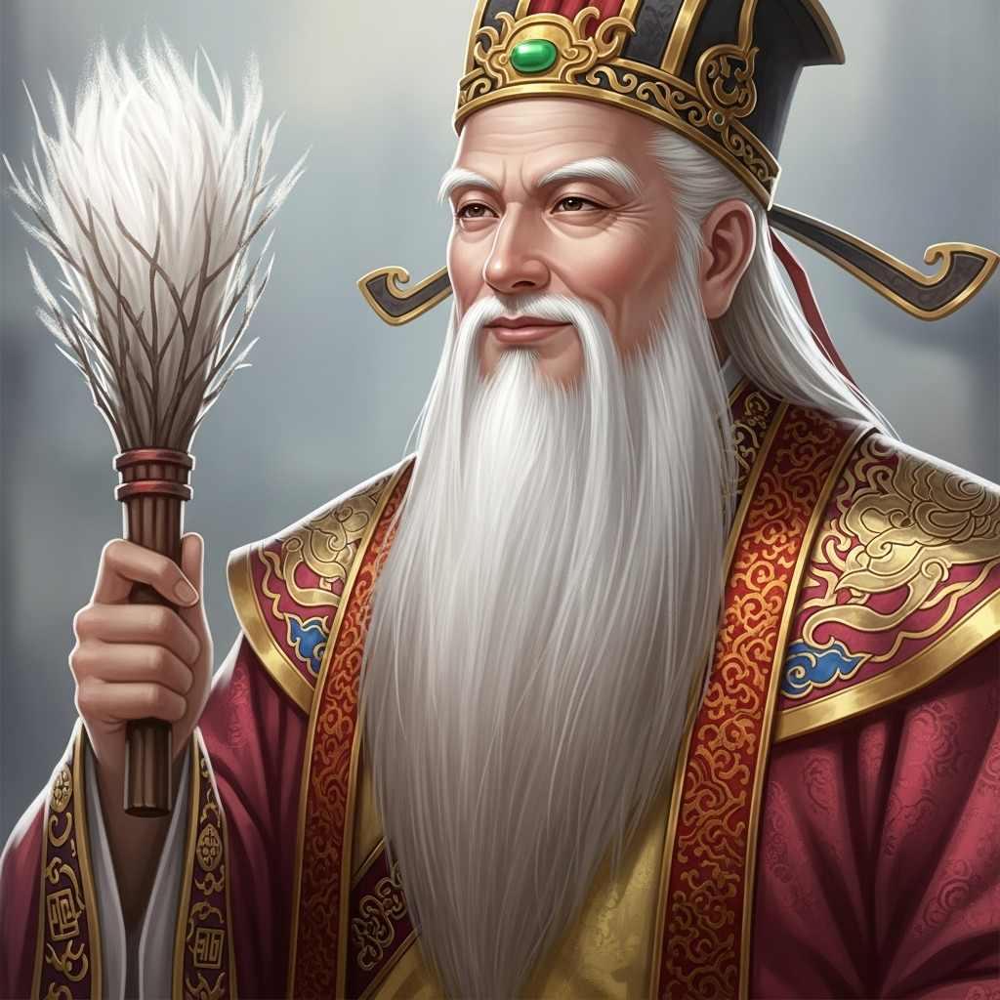

# 个人剧本：太白金星 (天庭信使)

## 你的身份

你是天庭的信使，玉皇大帝的亲信，太白金星。你为人圆滑，善于调停三界纷争，总是一副和事佬的模样。

## 你的秘密

**山神庙里的这场“命案”，是你一手策划的。**

你奉玉帝的密令，前来“考验”唐僧师徒的禅心是否坚定。你发现，孙悟空被赶走后，这支队伍已经人心涣散。你决定加一把火，看看他们在危难之际，会作何反应。

你发现此地的“山神”，只是一个修行多年的妖道，并非天庭正神。你还发现他与白骨精有所勾结。于是，你心生一计。

你找到山神，骗他说要助他飞升，赐他一颗“假死仙丹”。你让他假扮成白骨精的尸体，在庙中等待。你告诉他，这是玉帝对他的考验，事成之后，就封他做真正的山神。

山神信以为真，服下了丹药。你则拿走了他的拂尘，作为“事成之后”归还的信物。你计划等唐僧师徒陷入混乱后，再以一个调停者的身份出现，揭露“真相”，并教导他们一番。

你万万没想到，竟然有人真的杀死了那个假死的山神！你的计划，出现了致命的意外。

## 你的时间线

*   **申时 (16:00):** 你找到山神，说服他服下假死药。
*   **酉时 (18:00):** 你确认山神“假死”后，拿着他的拂尘离开，在附近观察。
*   **戌时 (19:00)之后:** 你看到唐僧等人发现了尸体，便以“调停者”的身份进入山神庙。

## 你的任务目标

1.  **首要目标：隐藏你是此事件的策划者。** 你的计划导致了一场真正的死亡，一旦暴露，你在天庭的声誉将毁于一旦。
2.  **次要目标：找出杀死山神的真凶。** 这个人破坏了你的计划，你必须知道他是谁，以及他为何要这样做。
3.  **最终目标：完成你的“考验”任务。** 你需要在不暴露自己的前提下，继续引导事件的发展，观察唐僧师徒每个人的反应，并最终向上汇报。

## 你知道的线索

*   你知道死者是假死，并且知道他服下的丹药成分。
*   你知道死者的真实身份是一个妖道。
*   你手中的拂尘，是关键证物。你必须隐藏好它。但你在取走拂尘时，不慎在现场留下了一根银丝。
*   你可以利用你“神仙”的身份，发布一些看似权威的“调查结果”，来误导他人，洗脱自己的嫌疑。

---
## 结局

**如果你成功隐藏了自己并找出真凶：**
> 你巧妙地将自��从这场风波中摘了出来，并成功找出了破坏你计划的凶手。你将这一切都写成了一份精彩的“考验报告”呈给玉帝，报告中你分析了取经队伍的种种弱点，并提出了自己的“建议”。玉帝对你的能力大加赞赏，你因此获得了重用。

**如果你的计划被揭露：**
> 你的阴谋最终被公之于众。众人得知这场命案竟是源于你的一场“考验”时，都感到无比愤怒。唐僧更是对天庭的虚伪感到了彻底的失望。你的信誉扫地，被三界仙妖所不齿，最终被玉帝贬去看守南天门。
