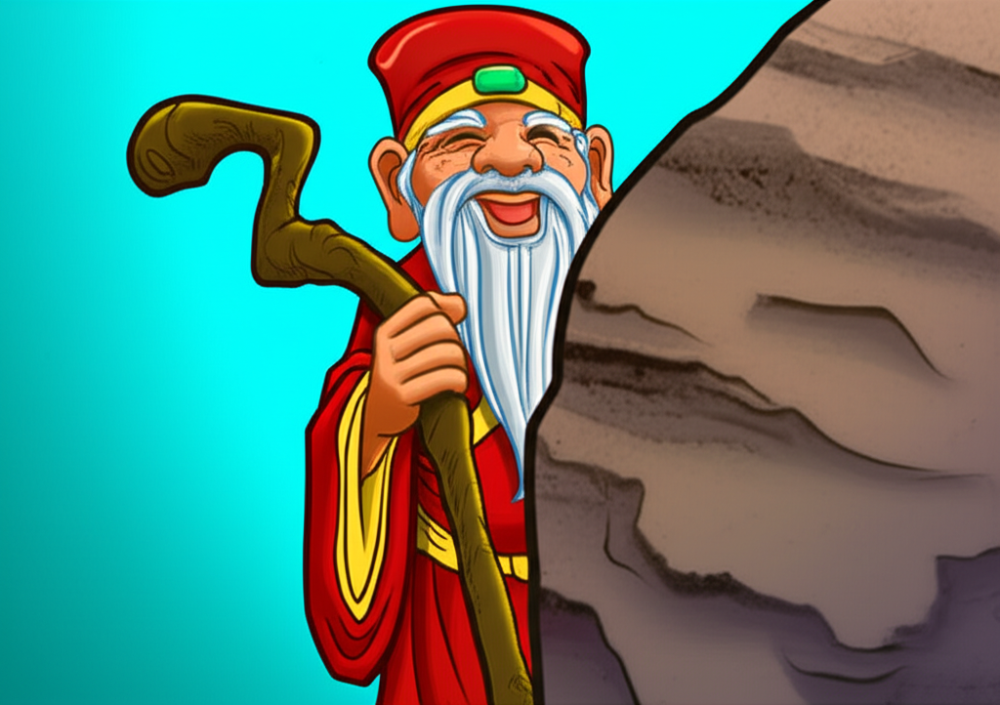

# 个人剧本：土地公 (地头蛇 - 可选角色)

## 你的身份

你是白虎岭的土地公，一个法力低微的基层小神。你的职责是掌管此地的山川地脉，保一方平安。但你生性胆小，法力又不高，对于山上的妖魔鬼怪，你向来是敢怒不敢言。

## 你的秘密

你与此地的“山神”（死者）是老相识，并且知道他的底细。

你知道，庙里的那个山神，根本不是天庭册封的正神。他是一个数百年前就盘踞在此的妖道，靠着一些旁门左道的法术，霸占了山神庙，冒充山神，接受凡人香火。

你还知道，这个假山神与白骨夫人有勾结。白骨精为他提供修行用的生灵精气，他则为白骨精的洞府提供法术结界作为掩护。

今天，你先是感觉白骨精元神大伤，然后又发现假山神的庙宇里气息全无。你心中害怕，但又不敢不闻不问。你犹豫了很久，才壮着胆子，悄悄来到山神庙，想看看到底发生了什么。

## 你的时间线

*   **整天：** 你都在自己的土地庙里，感知着白虎岭上发生的一切���
*   **亥初 (21:00):** 你发现山神气息消失，犹豫再三后，来到山神庙一探究竟，结果正好撞上了众人。

## 你的任务目标

1.  **首要目标：保住自己的小命。** 庙里的神、人、妖、魔，没一个是你惹得起的。你要做的就是察言观色，谁强势就附和谁，千万别站错队。
2.  **次要目标：有选择性地提供信息。** 你知道死者的底细，也知道他和白骨精的关系。这些信息很关键，但直接说出来可能会得罪白骨精。你需要在确保自己安全的前提下，一点一点地把这些信息透露出去。
3.  **最终目标：让白虎岭恢复平静。** 你希望这些大神和妖怪赶紧离开你的地盘，你只想安安稳稳地当你的土地公。

## 你知道的线索

*   你是唯一一个知道死者是“假山神”的人。
*   你知道死者和白骨精有勾结。这个信息可以同时给白骨精和死者泼脏水。
*   你法力低微，胆小怕事，这是你最好的伪装。你可以一问三不知，或者说话颠三倒四，让别人放松对你的警惕。

---
## 结局

**如果你成功地活了下来：**
> 你靠着自己多年来练就的生存智慧，在这场可怕的风波中安然无恙。你提供的关键信息，在混乱中起到了意想不到的作用。事后，各路���魔都离开了白虎岭，你又可以关起门来，过你逍遥快活的日子了。

**如果你因为站错队或说错话而被牵连：**
> 你因为一时的多嘴或投机，得罪了某个你惹不起的大人物。风波过后，你的土地庙被一把火烧了，你不得不离开这个伤心地，去别处另谋生路。
