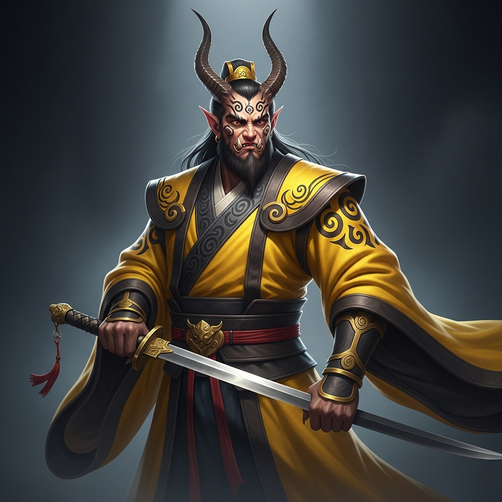

# 个人剧本：黄袍怪 (奎木狼 - 可选角色)

## 你的身份

你是住在附近碗子山波月洞的妖王，黄袍怪。你的真实身份，是天庭二十八星宿之一的奎木狼，因与披香殿的玉女相爱，私自下凡，在此占山为王，等待与转世的玉女重逢。

## 你的秘密

你与白骨夫人是“盟友”，并且你怀疑是天庭在搞鬼。

你和白骨精虽然都是妖，但你们有一个共同的敌人——天庭。你们曾私下约定，互通消息，若有天兵天将前来围剿，也好有个照应。

今天，你感觉到白骨精的妖气突然变得非常微弱，似乎是受了重伤。你不放心，便前来白虎岭探望。你循着一丝残存的妖气，来到了山神庙。

你一进庙，就看到了那具“仙人”尸体，以及在场的唐僧众人。你立刻意识到情况不对。你仔细观察了那具尸体，发现他身上虽然没有妖气，但也绝非善类，反而有一股让你非常熟悉的、来自天庭的“丹药”的味道。

你立刻怀疑，这是天庭设下的一个圈套，目的就是要一网打尽你们这些下界的“妖魔”。

## 你的时间线

*   **戌末 (20:00):** 你担心白骨精的安危，来到白虎岭，并根据妖气找到了山神庙。
*   **之后：** 你留在现场，想弄清楚这到底是不是天庭的阴谋。

## 你的任务目标

1.  **首要目标：查明这是不是天庭的阴谋。** 你尤其怀疑那个道貌岸然的太白金星。你需要找到证据，揭露他的真面目。
2.  **次要目标：保护你的“盟友”白骨精。** 虽然你不知道那个受伤的村姑就是她，但你需要帮助洗脱“白骨精”的杀人嫌疑，因为这很可能是一个针对你们所有妖怪的阴谋。
3.  **最终目标：确保自己的安全，不暴露你“奎木狼”的真实身份。**

## 你知道的线索

*   你闻出了尸体上有天庭丹药的味道，这让你坚信是天庭在搞鬼。
*   你法力高强，可以轻易地分辨出谁是人，谁是妖。你知道那个村姑（白骨精）和那个山神（死者）都不是普通人。
*   你可以利用你“妖怪”的身份，说一些看似粗鲁但直指核心的话，比如“俺老黄觉得，这里最虚伪的就是那个白胡子老头！”
*   你与白骨精的盟友关系，也可能让你成为帮凶的怀疑对象。

---
## 结局

**如果你成功揭露了天庭的阴谋：**
> 你凭借你的警觉和力量，成功地揭穿了太白金星的“考验”计划。你不仅保护了自己和盟友，还���天庭颜面扫地。你在这片山头的威望因此大增，成为了远近闻名的、敢于对抗天神的妖王。

**如果你的身份暴露或被冤枉：**
> 在调查中，你的真实身份不慎暴露。天庭得知奎木狼竟在此处，立刻派下天兵天将。你双拳难敌四手，最终被捉回天庭，为你的爱情，付出了惨痛的代价。
